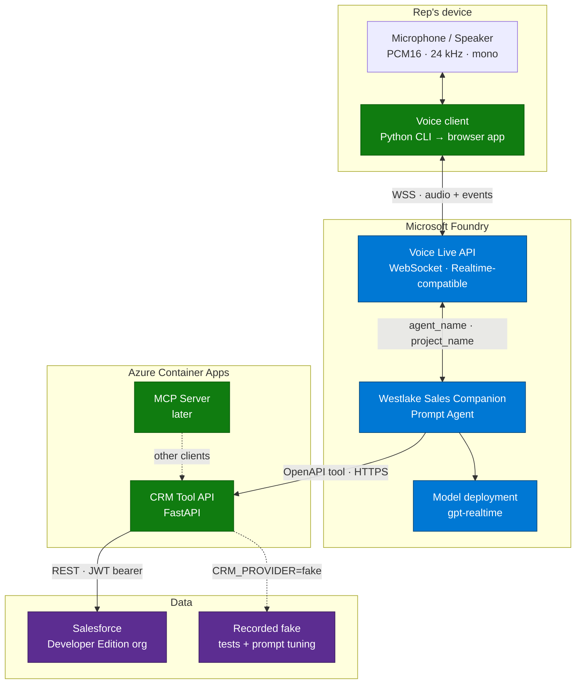
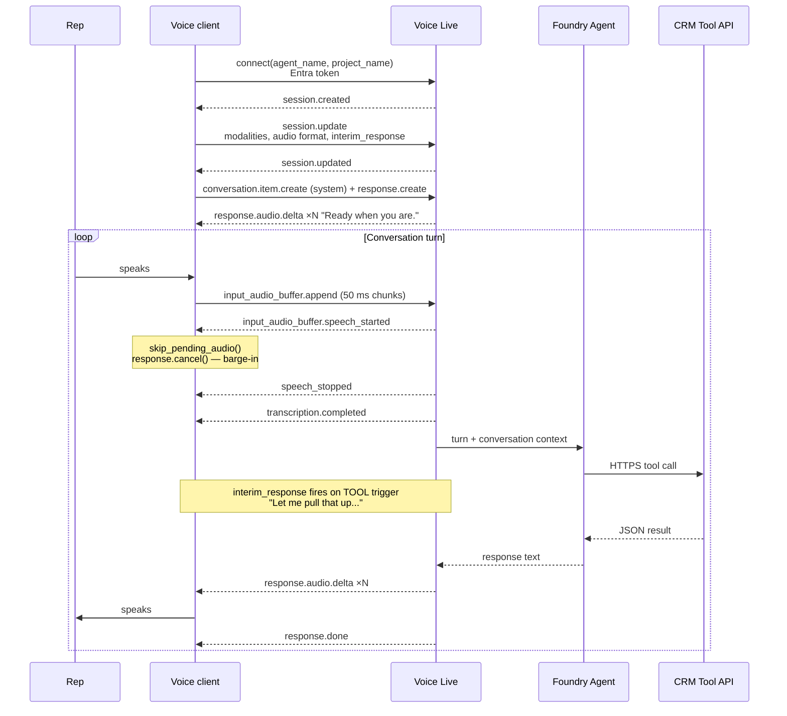
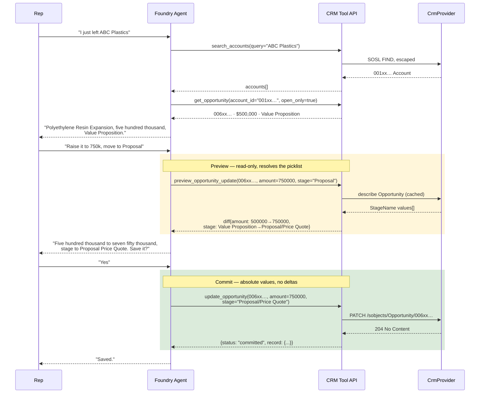
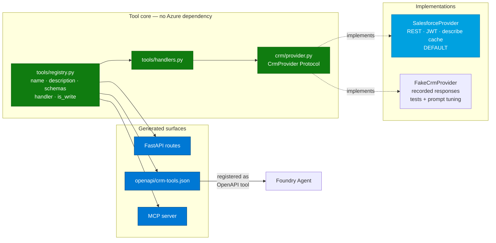
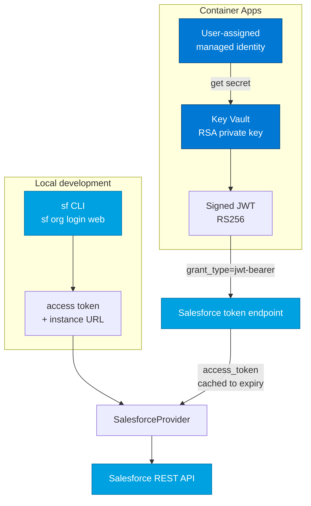
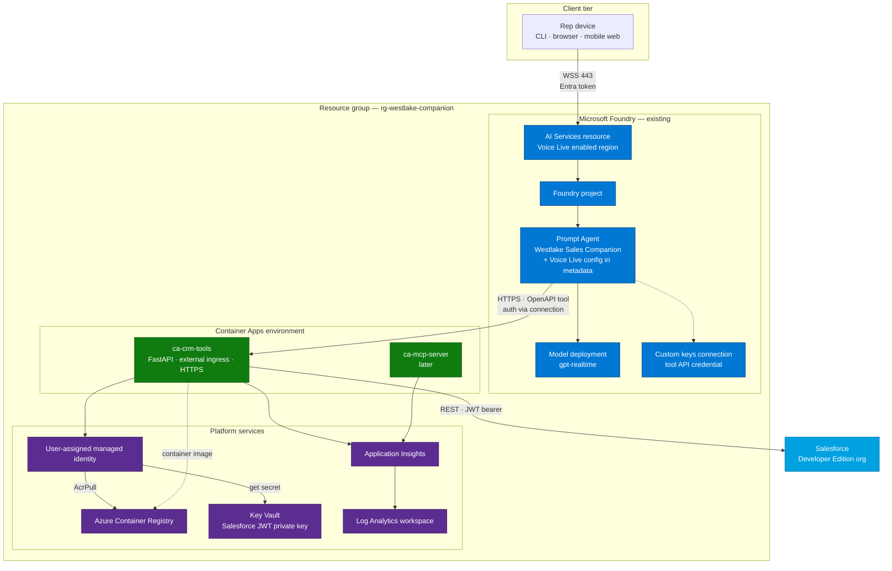
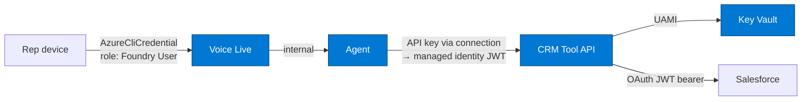

# CRM Sales Companion

A hands-free voice sales assistant for Westlake Chemical field reps, built on **Microsoft Foundry Agent Service** and the **Voice Live API**.

A rep driving between customer sites talks to the assistant like a sales-ops colleague — pulling up accounts, reviewing opportunities, updating amounts and stages, and creating follow-up tasks — without touching a keyboard.

> **Status:** Wired to a live Salesforce Developer Edition org from the start — no mock CRM dataset. A `CrmProvider` seam keeps tools decoupled from the data source, with a recorded in-memory fake used only for tests and offline prompt iteration so `pytest` needs no network and voice tuning doesn't burn API quota or litter the org.

---

## Table of contents

- [Target experience](#target-experience)
- [Architecture](#architecture)
  - [System context](#system-context)
  - [Voice flow](#voice-flow)
  - [Tool flow and the write-safety protocol](#tool-flow-and-the-write-safety-protocol)
  - [Provider layer](#provider-layer)
- [Salesforce integration](#salesforce-integration)
  - [Authentication](#authentication)
  - [Object mapping](#object-mapping)
  - [Durable idempotency via External ID](#durable-idempotency-via-external-id)
  - [Picklist resolution](#picklist-resolution)
  - [Query injection safety](#query-injection-safety)
  - [API limits](#api-limits)
- [Azure reference architecture](#azure-reference-architecture)
- [Key architectural decisions](#key-architectural-decisions)
- [Tool surface](#tool-surface)
- [Repository layout](#repository-layout)
- [Implementation plan](#implementation-plan)
- [Setup](#setup)
- [Local execution](#local-execution)
- [Deployment](#deployment)
- [Verification](#verification)
- [Future enhancements](#future-enhancements)

---

## Target experience

```
Rep:    I just left ABC Plastics.
Agent:  Found an open opportunity — Polyethylene Resin Expansion, five hundred
        thousand, Value Proposition. What do you want to do?

Rep:    Increase it to seven fifty and move it to Proposal.
Agent:  Changing the amount from five hundred thousand to seven fifty thousand,
        and the stage to Proposal Price Quote. Save it?

Rep:    Yes.
Agent:  Saved.

Rep:    Create a follow-up task to send pricing next Friday.
Agent:  Task created for Friday the twenty-eighth, assigned to you.
```

The rep says *"Proposal"*; Salesforce's stage picklist actually reads `Proposal/Price Quote`. The agent resolves spoken shorthand against the org's real picklist values rather than writing the literal string — see [Picklist resolution](#picklist-resolution).

Design rules baked into the agent instructions:

| Rule | Why |
|---|---|
| Responses under ~15 words unless reading back a change | The rep is driving; long responses are unsafe and unusable |
| Read back every field change before writing | Guards against misrecognition of amounts and dates |
| Never invent a record ID | Writes only accept IDs returned by a read in the same conversation |
| **Absolute values only, never deltas** | "Set it to 750k" survives a replay; "raise it by 250k" compounds |
| Every create carries an idempotency key | Road noise and repeated phrases must not create duplicate records |
| Stage names resolved against the live picklist | Spoken shorthand rarely matches the org's actual values |
| Deep noise suppression + semantic VAD | Car cabin audio, engine noise, passengers, radio |

---

## Architecture

### System context



The critical property: **the client never executes tools**. It streams audio and renders audio. All reasoning and all CRM access happen server-side, which means the browser client added later inherits the full capability set with zero additional trust.

### Voice flow



Two details that make or break the in-car feel:

- **Barge-in.** On `speech_started` the client drops queued playback and cancels the in-flight response. Playback packets carry sequence numbers so late-arriving audio from the cancelled response is discarded rather than played over the rep.
- **Interim responses.** `LlmInterimResponseConfig(triggers=[TOOL, LATENCY], latency_threshold_ms=100)` makes the agent say something natural while a CRM round-trip is in flight. Without it, tool calls produce multi-second silences that sound like a dropped call.

### Tool flow and the write-safety protocol

Writes are gated. The agent cannot mutate a record it has not read, and cannot mutate without an explicit spoken confirmation of a concrete diff.



| Threat | Mitigation |
|---|---|
| Hallucinated record | Writes reject any ID not returned by a read in this conversation |
| Misheard amount | `preview_opportunity_update` returns a diff the agent must read back verbatim |
| Replayed command compounding a value | Write tools accept absolute values only — never deltas |
| Duplicate task from repeated speech | Upsert on a **Unique External ID** field — enforced by Salesforce, not by app memory |
| Invalid stage name rejected by the API | Spoken stage resolved against cached `describe` picklist values |
| Spoken input reaching the query engine | SOSL with escaped reserved characters; no raw interpolation |
| Background speech triggering a write | Confirmation phrase required; VAD tuned with deep noise suppression |
| Accidental destructive edit | No delete tools exist in the surface at all |

### Provider layer

One registry is the single source of truth. REST routes, the OpenAPI document, and the MCP tool list are all generated from it — they cannot drift.



`CRM_PROVIDER` selects the implementation. `salesforce` is the default and what every demo and integration test runs against. `fake` exists so `pytest` needs no network or credentials, and so the dozens of iterations needed to tune prompts and barge-in don't consume API quota or leave junk records behind.

The fake is seeded from **recorded** Salesforce responses, not hand-written JSON — if the org's schema shifts, re-record rather than re-imagine.

---

## Salesforce integration

### Authentication

Two credential paths, each suited to its environment. The provider abstracts which one is in play.



The JWT bearer flow, used by the deployed API:

```http
POST https://login.salesforce.com/services/oauth2/token
grant_type=urn:ietf:params:oauth:grant-type:jwt-bearer
assertion=<RS256-signed JWT>
```

| JWT claim | Value |
|---|---|
| `iss` | Connected App consumer key |
| `sub` | Integration user's username |
| `aud` | `https://login.salesforce.com` (`test.salesforce.com` for sandboxes) |
| `exp` | now + 3 minutes |

The Connected App needs **Use digital signatures** with the public cert uploaded, OAuth scopes `api` and `refresh_token offline_access`, and the integration user's profile pre-authorized.

Salesforce credentials never leave the tool API. The agent holds no Salesforce identity — it authenticates to *our* API, and our API brokers onward. There is no password anywhere in the flow.

### Object mapping

| Domain model | Salesforce object | Notable fields |
|---|---|---|
| Account | `Account` | `Id`, `Name`, `Industry`, `Phone`, `BillingCity`, `BillingState` |
| Contact | `Contact` | `Id`, `AccountId`, `Name`, `Title`, `Email`, `Phone` |
| Opportunity | `Opportunity` | `Id`, `AccountId`, `Name`, `Amount`, `StageName`, `CloseDate`, `IsClosed` |
| Task | `Task` | `Subject`, `ActivityDate`, `WhatId`, `WhoId`, `OwnerId`, `Status`, `Priority`, `Description` |
| Logged call | `Task` with `Type='Call'`, `Status='Completed'` | Salesforce models a completed call as a Task, not a distinct object |
| Meeting | `Event` | `Subject`, `StartDateTime`, `WhatId` |

The mapping is explicit in `crm/salesforce_mapping.py` rather than inferred. Field names like `WhatId` and `ActivityDate` carry no meaning to the model, so the domain layer speaks `account_id` and `due_date` and the mapping translates.

### Durable idempotency via External ID

This is the design detail that changed most when moving off mocks.

Deduping an `idempotency_key` in a process-local dictionary works right up until the Container App restarts or scales to a second replica — then a replayed voice command creates a **second real Task in the customer's CRM**. In-process state is the wrong place for this guarantee.

Salesforce can enforce it in the database instead. A custom field on `Task`:

```xml
<CustomField xmlns="http://soap.sforce.com/2006/04/metadata">
    <fullName>Idempotency_Key__c</fullName>
    <label>Idempotency Key</label>
    <type>Text</type>
    <length>64</length>
    <externalId>true</externalId>
    <unique>true</unique>
</CustomField>
```

Creates then become upserts keyed on that field:

```http
PATCH /services/data/vXX.X/sobjects/Task/Idempotency_Key__c/{key}
```

| Response | Meaning | What the agent says |
|---|---|---|
| `201 Created` | First time this key was seen | "Task created." |
| `204 No Content` | Replay — same record updated in place | "Already got that one." |

The HTTP status distinguishes a genuine create from a replay, so the assistant can respond honestly instead of silently swallowing the duplicate.

**Updates don't need this.** Setting `Amount = 750000` twice leaves the same state, so `Opportunity` needs no External ID field. That property only holds because write tools accept **absolute values and never deltas** — the reason that rule is enforced in the tool contract rather than left to the prompt.

### Picklist resolution

`Opportunity.StageName` is a picklist whose values are org-specific. A stock org ships:

```
Prospecting · Qualification · Needs Analysis · Value Proposition
Id. Decision Makers · Perception Analysis · Proposal/Price Quote
Negotiation/Review · Closed Won · Closed Lost
```

A rep says *"move it to Proposal."* Writing the literal string `Proposal` fails — the value is `Proposal/Price Quote`. So the provider calls `describe` on `Opportunity`, caches the picklist, and resolves spoken shorthand against it. An unresolvable or ambiguous stage is an error the agent surfaces as a spoken question, never a guess.

This generalises: any picklist the tools write to gets resolved the same way, which is what keeps the assistant portable to a real Westlake org with customised stages.

### Query injection safety

`search_accounts` builds a query from **spoken user input**, and the Salesforce REST API has **no bind parameters** for SOQL — the query is a string you assemble. That is a live injection surface.

Mitigation, in order of preference:

1. **SOSL for name search** — `FIND {term} IN NAME FIELDS RETURNING Account(Id, Name, Industry)`, with SOSL reserved characters escaped: `? & | ! { } [ ] ( ) ^ ~ * : \ " ' + -`
2. **Escaped SOQL literals** where SOSL doesn't fit — backslash and single-quote escaped, length-capped, character-class validated
3. **Never** string-interpolate a raw transcript into a query

Escaping lives in one place, `crm/soql.py`, with tests covering the reserved-character set. It is not open-coded per call site.

### API limits

Developer Edition allows **15,000 API calls per rolling 24 hours**. A single voice turn can spend several — search, describe, read, preview, write.

That budget is fine for demos and integration runs, and completely inadequate for the iteration loop of tuning agent instructions. Hence `CRM_PROVIDER=fake` for prompt work and the full test suite, `salesforce` for anything that needs to be real.

---

## Azure reference architecture



### Resource inventory

| Resource | Purpose | Provisioned by |
|---|---|---|
| Microsoft Foundry AI Services + project | Hosts Voice Live and the agent | **Existing** — referenced as a parameter |
| Model deployment (`gpt-realtime`) | Agent reasoning + native audio | Existing |
| Prompt Agent | Instructions, Voice Live session config, OpenAPI tool binding | `agent/provision.py` |
| Salesforce Developer Edition org | System of record | **Existing** — Connected App added during setup |
| Container Apps environment | Runtime for tool API and MCP server | Bicep |
| Container App — CRM Tool API | Executes CRM tools; called by Foundry, calls Salesforce | Bicep + `azd deploy` |
| Azure Container Registry | Container images | Bicep |
| User-assigned managed identity | ACR pull, Key Vault access | Bicep |
| Key Vault | Salesforce JWT signing key | Bicep |
| Log Analytics + Application Insights | Traces, tool latency, Salesforce API call counts | Bicep |

### Identity and authentication



Non-negotiables:

- **Voice Live agent mode is Entra-only.** API keys are rejected outright for agent invocation. Local dev uses `AzureCliCredential`; deployed clients use managed identity.
- **The tool API is never anonymous.** It exposes write endpoints on a public ingress that mutate a real CRM. It authenticates via an API key stored in a Foundry custom-keys connection, moving to managed identity with Entra JWT validation.
- **No secrets in source, in agent metadata, or in the container image.** The Salesforce private key lives in Key Vault and is fetched at runtime via managed identity. Agent metadata holds Voice Live session config only.
- **The `.key` and `.pem` files generated during setup are gitignored.** They are the credential.

---

## Key architectural decisions

### Agent mode over model mode

Voice Live supports two topologies. We use **agent mode**.

| | Model mode | **Agent mode (chosen)** |
|---|---|---|
| Tool execution | Client-side, in-process | **Server-side, by Foundry** |
| Instructions live in | Session config, per connection | **Agent definition, versioned** |
| Auth | API key or Entra | **Entra only** |
| Tool API reachability | Not required | **Must be publicly reachable** |
| New client cost | Reimplement tools per client | **Zero — clients only stream audio** |

The tradeoff we accepted: Foundry has to reach the tool API, so even local development needs a dev tunnel. We took it because it means the browser client, and any future mobile or telephony client, inherits every capability without reimplementing a single tool.

### OpenAPI tools for the voice path, MCP as a parallel surface

The MCP tool's `require_approval` defaults to `always`, and that approval handshake is submitted through the runs API — which a Voice Live session does not surface. An MCP write tool would therefore hang forever in a voice conversation.

So: **the voice path uses OpenAPI tools.** The MCP server ships as a Phase 2 deliverable exposing the same registry to other clients (IDE agents, chat surfaces), where the approval loop is both available and desirable.

### Preview-then-commit instead of client-side confirmation

Confirmation logic lives in the tool contract, not just the prompt. `preview_opportunity_update` is a real read-only endpoint returning a structured diff with the picklist already resolved. The agent is instructed to call it before any mutation. Prompt-only confirmation is one jailbreak away from a bad write; this is defense in depth.

### Idempotency in the database, not the process

The obvious implementation — a dictionary of seen idempotency keys — silently fails on restart or a second replica, and the failure mode is duplicate records in a customer's CRM. Pushing the constraint into a **Unique External ID** field makes Salesforce itself the arbiter, and the `201` vs `204` response tells the agent which happened.

This only works because writes are restricted to absolute values. A delta-based API (`increase_amount_by`) cannot be made idempotent this way, which is why that shape was excluded from the tool surface.

### Live org from day one, recorded fake for iteration

Building against mock data first tends to produce tools shaped around imagined records — and every real-schema surprise arrives late. Going live-first surfaced picklist resolution, External ID upserts, and SOQL escaping as *design* concerns rather than integration bugs.

The fake still exists, but it is a recorded test double, not a parallel data model: `pytest` runs offline, prompt iteration doesn't consume the 15k/day API budget, and demos run against real records.

---

## Tool surface

| Tool | Kind | Notes |
|---|---|---|
| `search_accounts` | read | SOSL name search, escaped. The entry point for "I just left ..." |
| `get_account` | read | Account with related open opportunities |
| `get_contact` | read | Contact detail by ID or account + name |
| `get_opportunity` | read | By ID, or open opportunities for an account |
| `list_tasks` | read | Upcoming tasks for the running user |
| `preview_opportunity_update` | **preview** | Read-only diff with `StageName` resolved against the live picklist |
| `update_opportunity` | **write** | Absolute values only. `PATCH` by record ID |
| `create_task` | **write** | Upsert on `Idempotency_Key__c` |
| `create_activity` | **write** | Completed `Task` of `Type='Call'`, or `Event` for meetings |
| `create_call_report` | **write** | Completed call Task carrying notes in `Description` |

No delete operations exist, and no tool accepts a relative adjustment. A voice interface in a moving car is the wrong place for destructive verbs or arithmetic that compounds on replay.

---

## Repository layout

```
azure.yaml                          azd service + hook definitions
pyproject.toml                      dependencies, tooling, pytest config
.env.example                        every required variable, documented
infra/
  main.bicep                        subscription-scope entry point
  main.parameters.json
  modules/                          ACA env, container app, ACR, UAMI,
                                    Key Vault, monitoring
sfdx/
  force-app/main/default/objects/
    Task/fields/
      Idempotency_Key__c.field-meta.xml    External ID + Unique
    Event/fields/
      Idempotency_Key__c.field-meta.xml
src/westlake/
  config.py                         pydantic-settings; fails fast on missing config
  crm/
    models.py                       pydantic domain models
    provider.py                     CrmProvider Protocol — the seam
    salesforce_provider.py          DEFAULT — REST, JWT, describe cache, upsert
    salesforce_auth.py              sf CLI token (local) / JWT bearer (deployed)
    salesforce_mapping.py           domain ↔ SObject field translation
    soql.py                         SOSL/SOQL escaping — the only place it happens
    fake_provider.py                recorded responses; tests + prompt tuning
    recordings/                     captured API responses, refreshed not authored
  tools/
    registry.py                     single source of truth for all tools
    handlers.py                     the ten handlers
  api/
    app.py                          FastAPI; routes generated from registry
    security.py                     API key → Entra JWT
    openapi.py                      spec exporter
  mcp/
    server.py                       MCP streamable-HTTP over the same registry
  agent/
    instructions.py                 driving-optimized prompt + confirmation policy
    voicelive_config.py             session config + 512-char metadata chunking
    provision.py                    create/update agent version
    smoketest.py                    text-mode agent test — no audio
  voice/
    audio.py                        PyAudio capture/playback, barge-in queue
    session.py                      shared Voice Live event loop
    cli.py                          agent-mode CLI entry point
openapi/crm-tools.json              generated artifact, committed
scripts/
  seed_org.py                       creates the demo Account + Opportunity
  record_fixtures.py                captures live responses for the fake
  new_jwt_cert.sh                   self-signed cert for the Connected App
tests/                              handler, idempotency, escaping, spec validity
docs/                               deep-dive architecture notes
```

---

## Implementation plan

### Phase 1 — Org access and preparation
*Nothing else can be verified until the API answers.*

1. Install the Salesforce CLI, `sf org login web`, confirm API access with a raw REST call
2. Create the Connected App: digital signatures, self-signed cert, scopes `api` + `refresh_token offline_access`, pre-authorized profile
3. Deploy `Idempotency_Key__c` to `Task` and `Event` — Text(64), External ID, Unique
4. Run `scripts/seed_org.py` to create ABC Plastics and the $500K Polyethylene Resin Expansion opportunity at stage `Value Proposition`
5. Verify the JWT bearer flow independently of the app

### Phase 2 — Domain and provider

6. pydantic domain models and the `CrmProvider` Protocol
7. `salesforce_auth.py` — sf CLI token locally, JWT bearer deployed, with token caching
8. `soql.py` — SOSL/SOQL escaping with tests over the full reserved-character set **before** any query is built
9. `salesforce_provider.py` — reads, describe cache, stage resolution, upsert-by-External-ID
10. `record_fixtures.py` → `fake_provider.py` seeded from real captured responses

### Phase 3 — Tool core

11. `tools/registry.py` — the keystone every other surface generates from
12. The ten handlers, including `preview_opportunity_update`
13. pytest against the fake: handlers, idempotency replay, stage resolution, escaping

### Phase 4 — Tool API and OpenAPI spec

14. FastAPI routes generated from the registry, explicit `operationId` per tool
15. API-key validation; anonymous auth is off the table for endpoints that mutate a real CRM
16. OpenAPI 3.1 export with populated `servers[]`, validated in CI

### Phase 5 — Foundry agent

17. Instructions: driving-optimized, preview-before-write, absolute values, stage resolution
18. Voice Live session config plus 512-char metadata chunk/reassemble helpers
19. `provision.py` — create/update the agent version with the OpenAPI tool attached
20. `smoketest.py` — **text-mode** test proving tool calling before audio enters the picture

### Phase 6 — Voice CLI

21. 24 kHz PCM16 mono audio, 50 ms chunks, sequence-numbered playback for barge-in
22. Agent-mode connect, proactive greeting, barge-in, dual logging

### Phase 7 — Deploy

23. Bicep: ACR, Container Apps, managed identity, **Key Vault for the Salesforce key**, monitoring
24. `azd up`, repoint `servers[0].url`, re-provision the agent

### Phase 8 — MCP and docs

25. MCP server over the same registry, deep-dive docs, stretch-goal design notes

---

## Setup

### Prerequisites

| Requirement | Notes |
|---|---|
| Python 3.11+ | |
| Salesforce CLI | `npm i -g @salesforce/cli` — not currently installed |
| Salesforce Developer Edition org | With **admin/Setup access** — required for the Connected App and custom field |
| Azure CLI | `az login` — agent mode requires Entra auth |
| Azure Developer CLI (`azd`) | Deployment |
| `devtunnel` CLI | Local dev — Foundry must reach your tool API |
| PortAudio | macOS: `brew install portaudio` (PyAudio dependency) |
| Microsoft Foundry project | In a Voice Live–supported region, with a model deployment |
| Role: **Foundry User** | On the Foundry resource, for your account |

### Salesforce org preparation

```bash
# 1. Authenticate the CLI to the dev org
npm i -g @salesforce/cli
sf org login web --alias devorg --set-default
sf org display --target-org devorg          # confirm connection

# 2. Generate a keypair for the Connected App
./scripts/new_jwt_cert.sh                   # writes .secrets/server.key + server.crt

# 3. Create the Connected App in Setup > App Manager:
#      - Enable OAuth Settings
#      - Callback URL: http://localhost:1717/OauthRedirect
#      - Use digital signatures -> upload .secrets/server.crt
#      - Scopes: api, refresh_token offline_access
#      - After save: Manage > Edit Policies > Permitted Users =
#        "Admin approved users are pre-authorized", then assign your profile
#    Copy the Consumer Key into SF_CLIENT_ID

# 4. Deploy the idempotency field
sf project deploy start --source-dir sfdx/force-app --target-org devorg

# 5. Seed the demo records
python -m scripts.seed_org

# 6. Capture fixtures for the offline fake
python -m scripts.record_fixtures
```

> `.secrets/` is gitignored. `server.key` is the credential that grants API access to the org — it belongs in Key Vault, never in the repo or the container image.

### Configuration

Copy `.env.example` to `.env` and fill in:

```bash
# Provider selection
CRM_PROVIDER=salesforce          # or 'fake' for offline prompt iteration

# Salesforce
SF_LOGIN_URL=https://login.salesforce.com   # test.salesforce.com for sandboxes
SF_CLIENT_ID=<Connected App consumer key>
SF_USERNAME=<integration user>
SF_PRIVATE_KEY_PATH=.secrets/server.key     # local only; Key Vault when deployed
SF_API_VERSION=<pin after checking /services/data>
SF_ORG_ALIAS=devorg                         # used by the sf CLI auth path

# Foundry project
PROJECT_ENDPOINT=https://<resource>.services.ai.azure.com/api/projects/<project>
PROJECT_NAME=<project>
MODEL_DEPLOYMENT_NAME=gpt-realtime

# Voice Live
VOICELIVE_ENDPOINT=https://<resource>.services.ai.azure.com/
VOICELIVE_API_VERSION=<pin to installed SDK — see note below>
VOICE_NAME=en-US-Ava:DragonHDLatestNeural

# Agent
AGENT_NAME=crm-sales-companion
AGENT_VERSION=            # optional — pin for controlled rollout
CONVERSATION_ID=          # optional — resume a prior conversation

# Tool API
TOOL_API_BASE_URL=https://<devtunnel-or-aca-fqdn>
TOOL_API_KEY=<generated>
```

> **Version pinning.** Current docs show `2026-01-01-preview` for agent-mode connect and `2026-04-10` for model mode. Pin both against the installed `azure-ai-voicelive` and `azure-ai-projects` versions before writing session code rather than trusting the doc snippets. Same for the Salesforce REST version — read `/services/data` and pin it.

---

## Local execution

```bash
# 1. Install
python -m venv .venv && source .venv/bin/activate
pip install -e ".[dev]"

# 2. Tests — offline, no Azure or Salesforce needed
pytest

# 3. Confirm live Salesforce access
python -m westlake.crm.salesforce_provider --check     # whoami + describe + API limits

# 4. Generate and validate the OpenAPI spec
python -m westlake.api.openapi
openapi-spec-validator openapi/crm-tools.json

# 5. Run the tool API against the dev org
uvicorn westlake.api.app:app --reload --port 8000

# 6. Expose it to Foundry (separate terminal)
devtunnel host -p 8000 --allow-anonymous
# Copy the tunnel URL into TOOL_API_BASE_URL

# 7. Provision the agent
az login
python -m westlake.agent.provision

# 8. Text-mode smoke test — verify tool calling before touching audio
python -m westlake.agent.smoketest

# 9. Full voice conversation
python -m westlake.voice.cli
```

Step 8 exists deliberately. Debugging tool invocation and audio plumbing simultaneously is miserable; proving the agent calls tools correctly over text first removes an entire class of confusion from step 9.

While iterating on agent instructions, set `CRM_PROVIDER=fake`. Prompt tuning takes dozens of runs, and each live turn spends several of Developer Edition's 15,000 daily API calls while leaving real Tasks behind in the org. Switch back to `salesforce` to validate.

---

## Deployment

```bash
azd auth login
azd env new westlake-poc

# Point at the existing Foundry project
azd env set AZURE_AI_PROJECT_ENDPOINT "<project endpoint>"
azd env set AZURE_LOCATION "<voice-live-supported region>"

azd up

# Repoint the tool spec at the deployed API and re-register the agent
azd env get-values | grep TOOL_API_BASE_URL
python -m westlake.api.openapi
python -m westlake.agent.provision
```

`azd up` provisions the Container Apps environment, registry, managed identity, and monitoring, then builds and deploys the tool API. The Foundry project is referenced, never created — the plan assumes you already own it.

---

## Verification

| # | Check | Command |
|---|---|---|
| 1 | Handlers, idempotency replay, stage resolution, query escaping | `pytest` |
| 2 | Live org reachable; JWT flow works; field deployed | `python -m westlake.crm.salesforce_provider --check` |
| 3 | OpenAPI spec is valid 3.1 with populated `servers[]` | `python -m westlake.api.openapi && openapi-spec-validator openapi/crm-tools.json` |
| 4 | Every operation responds against the dev org | `uvicorn ...` + curl each `operationId` |
| 5 | Agent invokes tools correctly | `python -m westlake.agent.smoketest` |
| 6 | Full spoken loop | `python -m westlake.voice.cli` |
| 7 | Deployed path | `azd up` → re-provision → repeat 6 |

**Acceptance script for check 6** — speak the demo conversation end to end:

1. "I just left ABC Plastics" → agent reads back the open opportunity at `Value Proposition`
2. "Raise it to 750 thousand and move it to Proposal" → agent reads back the **diff**, having resolved `Proposal` → `Proposal/Price Quote`, and waits
3. Interrupt mid-sentence → playback stops immediately, agent yields
4. "Yes" → agent confirms the write in four words or fewer
5. Verify in the Salesforce UI that Amount and Stage actually changed
6. "Create a follow-up task to send pricing next Friday" → task created, date read back
7. Repeat step 6 verbatim → agent says it already exists, and **the org contains exactly one Task**

Step 7 is the one people skip. It's the one that matters in a car — and now it's verifiable by querying the org rather than trusting an in-memory counter.

---

## Future enhancements

### Near term

- **Browser voice client.** Web Audio capture → WebSocket relay in Container Apps → Voice Live. Phone-friendly, no local audio dependencies, and the natural demo vehicle for a rep in a vehicle.
- **Managed identity for the tool API.** Replace the API-key connection with Foundry managed identity plus Entra JWT validation at the Container App.
- **Conversation resume.** Thread `conversation_id` through reconnects so a dropped cellular connection resumes mid-thought instead of starting over.
- **Per-rep record ownership.** Today one integration user owns every write. Real deployment needs the rep's own Salesforce identity so `OwnerId` and `CreatedById` reflect who actually spoke.

### Stretch capabilities

| Capability | Utterance | Composition |
|---|---|---|
| Pre-meeting briefing | "Brief me on my next customer" | `list_tasks` + `get_account` + `get_opportunity`, summarized for audio |
| Post-meeting capture | "Record today's notes" | Extended dictation → `create_call_report` + `create_activity` |
| Forecast coaching | "What should I focus on this week?" | Pipeline query ranked by stage, amount, and staleness |
| Generated follow-ups | Automatic after a call report | Draft task, activity, and follow-up email for review |

### Platform

- **Multi-rep identity.** Per-rep Entra identity federated to Salesforce, so the assistant acts *as* the rep rather than as a shared integration user.
- **Evaluation suite.** Batch evals over recorded conversations for tool-selection accuracy and confirmation compliance — the two behaviors that must not regress.
- **Custom voice.** A brand-aligned voice via Azure custom neural voice (requires eligibility approval).
- **Telephony.** The same agent behind a phone number for reps without the app.
- **Production org hardening.** Field-level security review, a dedicated integration profile with least-privilege object permissions, and API call budgeting against the production org's limits.
