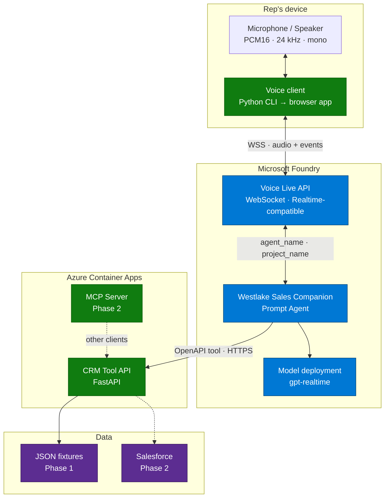
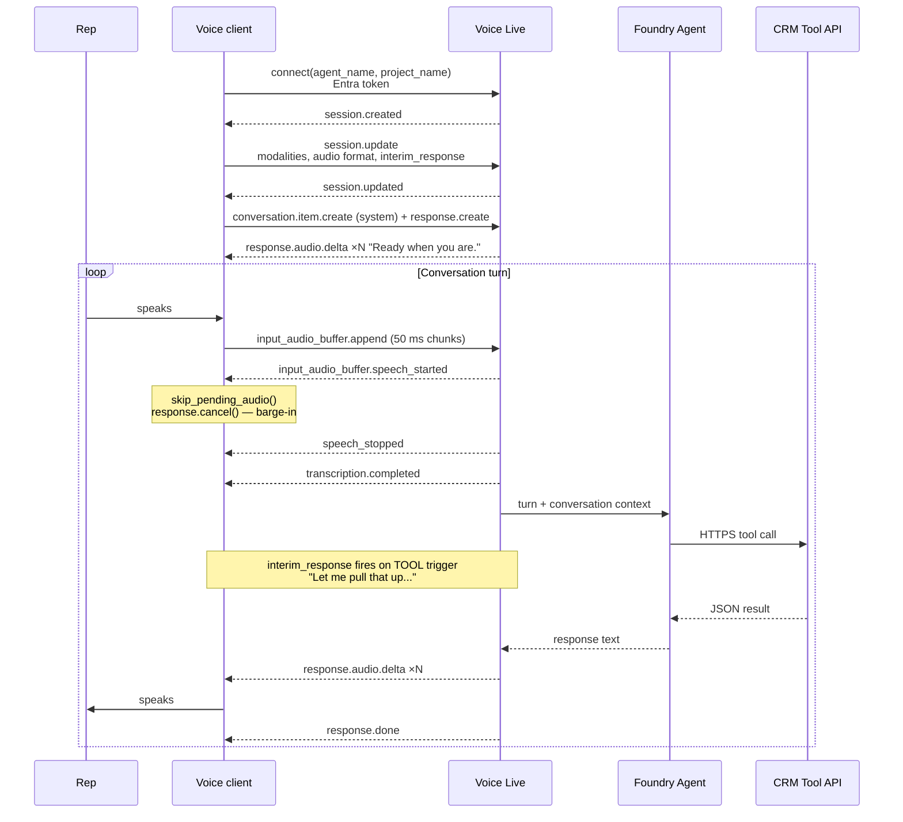
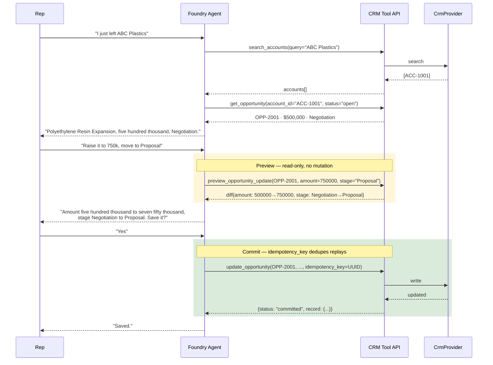
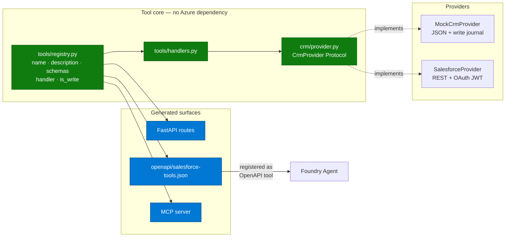
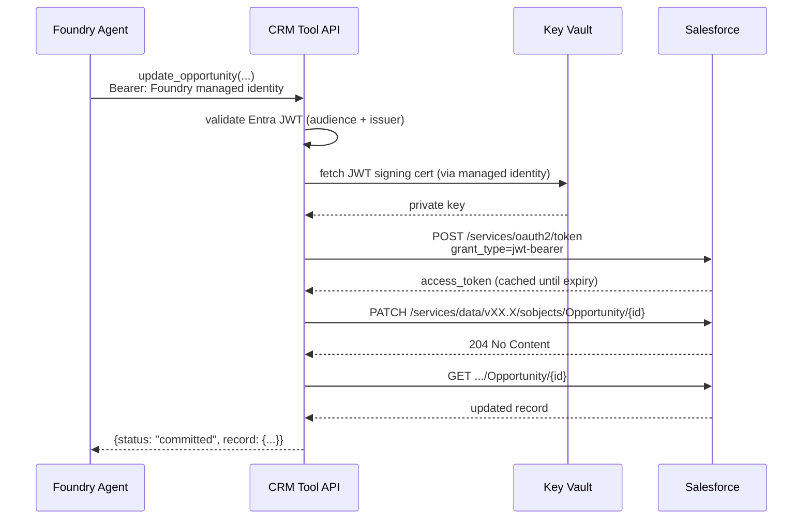
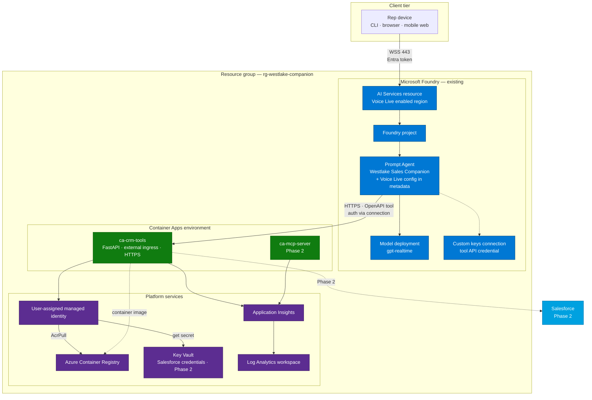
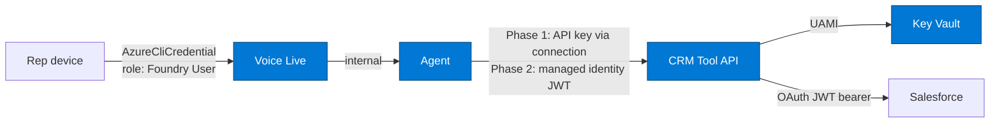

# CRM Sales Companion

A hands-free voice sales assistant for Westlake Chemical field reps, built on **Microsoft Foundry Agent Service** and the **Voice Live API**.

A rep driving between customer sites talks to the assistant like a sales-ops colleague — pulling up accounts, reviewing opportunities, updating amounts and stages, and creating follow-up tasks — without touching a keyboard.

> **Phase 1 status:** CRM data is JSON-backed mock data behind a clean provider interface. The agent, tool contracts, voice pipeline, and deployment are production-shaped from day one; only the data source is swapped in Phase 2.

---

## Table of contents

- [Target experience](#target-experience)
- [Architecture](#architecture)
  - [System context](#system-context)
  - [Voice flow](#voice-flow)
  - [Tool flow and the write-safety protocol](#tool-flow-and-the-write-safety-protocol)
  - [Tool abstraction layer](#tool-abstraction-layer)
  - [Phase 2 Salesforce integration flow](#phase-2-salesforce-integration-flow)
- [Azure reference architecture](#azure-reference-architecture)
- [Key architectural decisions](#key-architectural-decisions)
- [Tool surface](#tool-surface)
- [Repository layout](#repository-layout)
- [Implementation plan](#implementation-plan)
- [Setup](#setup)
- [Local execution](#local-execution)
- [Deployment](#deployment)
- [Verification](#verification)
- [Future enhancements](#future-enhancements)

---

## Target experience

```
Rep:    I just left ABC Plastics.
Agent:  Found an open opportunity — Polyethylene Resin Expansion, five hundred
        thousand, Negotiation. What do you want to do?

Rep:    Increase it to seven fifty and move it to Proposal.
Agent:  Changing the amount from five hundred thousand to seven fifty thousand,
        and the stage from Negotiation to Proposal. Save it?

Rep:    Yes.
Agent:  Saved.

Rep:    Create a follow-up task to send pricing next Friday.
Agent:  Task created for Friday the twenty-eighth, assigned to you.
```

Design rules baked into the agent instructions:

| Rule | Why |
|---|---|
| Responses under ~15 words unless reading back a change | The rep is driving; long responses are unsafe and unusable |
| Read back every field change before writing | Guards against misrecognition of amounts and dates |
| Never invent a record ID | Writes only accept IDs returned by a read in the same conversation |
| Every write carries an idempotency key | Road noise and repeated phrases must not create duplicate tasks |
| Deep noise suppression + semantic VAD | Car cabin audio, engine noise, passengers, radio |

---

## Architecture

### System context



The critical property: **the client never executes tools**. It streams audio and renders audio. All reasoning and all CRM access happen server-side, which means the browser client added later inherits the full capability set with zero additional trust.

### Voice flow



Two details that make or break the in-car feel:

- **Barge-in.** On `speech_started` the client drops queued playback and cancels the in-flight response. Playback packets carry sequence numbers so late-arriving audio from the cancelled response is discarded rather than played over the rep.
- **Interim responses.** `LlmInterimResponseConfig(triggers=[TOOL, LATENCY], latency_threshold_ms=100)` makes the agent say something natural while a CRM round-trip is in flight. Without it, tool calls produce multi-second silences that sound like a dropped call.

### Tool flow and the write-safety protocol

Writes are gated. The agent cannot mutate a record it has not read, and cannot mutate without an explicit spoken confirmation of a concrete diff.



| Threat | Mitigation |
|---|---|
| Hallucinated record | Writes reject any ID not returned by a read in this conversation |
| Misheard amount | `preview_opportunity_update` returns a diff the agent must read back verbatim |
| Duplicate task from repeated speech | Server-side dedupe on `idempotency_key` |
| Background speech triggering a write | Confirmation phrase required; VAD tuned with deep noise suppression |
| Accidental destructive edit | No delete tools exist in the surface at all |

### Tool abstraction layer

One registry is the single source of truth. REST routes, the OpenAPI document, and the MCP tool list are all generated from it — they cannot drift.



Swapping to real Salesforce is a one-file change plus a config flag. The agent definition, the OpenAPI contract, the voice pipeline, and every test are untouched.

### Phase 2 Salesforce integration flow



Salesforce credentials never leave the tool API. The agent holds no Salesforce identity — it authenticates to *our* API, and our API brokers to Salesforce with a server-side JWT bearer flow.

---

## Azure reference architecture



### Resource inventory

| Resource | Purpose | Provisioned by |
|---|---|---|
| Microsoft Foundry AI Services + project | Hosts Voice Live and the agent | **Existing** — referenced as a parameter |
| Model deployment (`gpt-realtime`) | Agent reasoning + native audio | Existing |
| Prompt Agent | Instructions, Voice Live session config, OpenAPI tool binding | `agent/provision.py` |
| Container Apps environment | Runtime for tool API and MCP server | Bicep |
| Container App — CRM Tool API | Executes CRM tools; called by Foundry | Bicep + `azd deploy` |
| Azure Container Registry | Container images | Bicep |
| User-assigned managed identity | ACR pull, Key Vault access, Salesforce broker identity | Bicep |
| Key Vault | Salesforce JWT signing cert (Phase 2) | Bicep |
| Log Analytics + Application Insights | Traces, tool latency, conversation telemetry | Bicep |

### Identity and authentication



Non-negotiables:

- **Voice Live agent mode is Entra-only.** API keys are rejected outright for agent invocation. Local dev uses `AzureCliCredential`; deployed clients use managed identity.
- **The tool API is never anonymous.** It exposes write endpoints on a public ingress. Phase 1 authenticates via an API key stored in a Foundry custom-keys connection; Phase 2 moves to managed identity with Entra JWT validation at the API.
- **No secrets in source or in agent metadata.** Agent metadata holds Voice Live session config only.

---

## Key architectural decisions

### Agent mode over model mode

Voice Live supports two topologies. We use **agent mode**.

| | Model mode | **Agent mode (chosen)** |
|---|---|---|
| Tool execution | Client-side, in-process | **Server-side, by Foundry** |
| Instructions live in | Session config, per connection | **Agent definition, versioned** |
| Auth | API key or Entra | **Entra only** |
| Tool API reachability | Not required | **Must be publicly reachable** |
| New client cost | Reimplement tools per client | **Zero — clients only stream audio** |

The tradeoff we accepted: Foundry has to reach the tool API, so even local development needs a dev tunnel. We took it because it means the browser client, and any future mobile or telephony client, inherits every capability without reimplementing a single tool.

### OpenAPI tools for the voice path, MCP as a parallel surface

The MCP tool's `require_approval` defaults to `always`, and that approval handshake is submitted through the runs API — which a Voice Live session does not surface. An MCP write tool would therefore hang forever in a voice conversation.

So: **the voice path uses OpenAPI tools.** The MCP server ships as a Phase 2 deliverable exposing the same registry to other clients (IDE agents, chat surfaces), where the approval loop is both available and desirable.

### Preview-then-commit instead of client-side confirmation

Confirmation logic lives in the tool contract, not just the prompt. `preview_opportunity_update` is a real read-only endpoint returning a structured diff. The agent is instructed to call it before any mutation, and the write endpoint independently requires an idempotency key. Prompt-only confirmation is one jailbreak away from a bad write; this is defense in depth.

---

## Tool surface

| Tool | Kind | Notes |
|---|---|---|
| `search_accounts` | read | Fuzzy name match; the entry point for "I just left ..." |
| `get_account` | read | Full account with recent activity |
| `get_contact` | read | Contact detail by ID or account + name |
| `get_opportunity` | read | By ID, or open opportunities for an account |
| `list_tasks` | read | Upcoming tasks for the rep |
| `preview_opportunity_update` | **preview** | Returns before/after diff. Mutates nothing. |
| `update_opportunity` | **write** | Requires `idempotency_key` |
| `create_task` | **write** | Requires `idempotency_key` |
| `create_activity` | **write** | Requires `idempotency_key` |
| `create_call_report` | **write** | Requires `idempotency_key` |

No delete operations exist. A voice interface with road noise is the wrong place to expose destructive verbs.

---

## Repository layout

```
azure.yaml                          azd service + hook definitions
pyproject.toml                      dependencies, tooling, pytest config
.env.example                        every required variable, documented
infra/
  main.bicep                        subscription-scope entry point
  main.parameters.json
  modules/                          ACA env, container app, ACR, UAMI, monitoring
src/westlake/
  config.py                         pydantic-settings; fails fast on missing config
  data/                             JSON fixtures — accounts, contacts,
                                    opportunities, tasks, activities
  crm/
    models.py                       pydantic domain models
    provider.py                     CrmProvider Protocol — the swap seam
    mock_provider.py                JSON reads + in-memory write journal
    salesforce_provider.py          Phase 2 — REST + OAuth JWT bearer
  tools/
    registry.py                     single source of truth for all tools
    handlers.py                     the ten handlers
  api/
    app.py                          FastAPI; routes generated from registry
    security.py                     API key (P1) → Entra JWT (P2)
    openapi.py                      spec exporter
  mcp/
    server.py                       MCP streamable-HTTP over the same registry
  agent/
    instructions.py                 driving-optimized prompt + confirmation policy
    voicelive_config.py             session config + 512-char metadata chunking
    provision.py                    create/update agent version
    smoketest.py                    text-mode agent test — no audio
  voice/
    audio.py                        PyAudio capture/playback, barge-in queue
    session.py                      shared Voice Live event loop
    cli.py                          agent-mode CLI entry point
openapi/salesforce-tools.json       generated artifact, committed
tests/                              handler, idempotency, spec-validity tests
docs/                               deep-dive architecture notes
scripts/                            dev tunnel helper, provisioning wrappers
```

---

## Implementation plan

### Phase 1 — Tool core
*No Azure dependency. Fully testable offline.*

1. Scaffold `pyproject.toml`, `config.py`, `.env.example`
2. Author JSON fixtures in `src/westlake/data/` — seeded with ABC Plastics and the $500K Polyethylene Resin Expansion opportunity from the demo script
3. Define pydantic models, the `CrmProvider` Protocol, and `MockCrmProvider`
4. Build `tools/registry.py` — the keystone every other surface generates from
5. Implement the ten handlers, including `preview_opportunity_update` and idempotency-keyed writes
6. pytest coverage: handlers, idempotency replay, preview diff correctness

### Phase 2 — Tool API and OpenAPI spec

7. `api/app.py` — FastAPI routes generated from the registry, with explicit `operationId` per tool (these become the agent's tool names)
8. `api/security.py` — API key validation; anonymous auth is off the table for write endpoints
9. `api/openapi.py` — export OpenAPI 3.1 with populated `servers[]`, validated in CI

### Phase 3 — Foundry agent

10. `agent/instructions.py` — the driving-optimized prompt and confirmation policy
11. `agent/voicelive_config.py` — session config plus 512-char metadata chunk/reassemble helpers
12. `agent/provision.py` — create/update the agent version with the OpenAPI tool attached
13. `agent/smoketest.py` — **text-mode** conversation test; proves tool calling before audio enters the picture

### Phase 4 — Voice CLI

14. `voice/audio.py` — 24 kHz PCM16 mono, 50 ms chunks, sequence-numbered playback for barge-in
15. `voice/session.py` + `voice/cli.py` — agent-mode connect, proactive greeting, barge-in, dual logging

### Phase 5 — Deploy

16. Bicep + `azure.yaml` — ACR, Container Apps, managed identity, monitoring. Foundry project is an input parameter, not created.
17. `azd up`, repoint the spec's `servers[0].url` at the Container App FQDN, re-provision the agent

### Phase 6 — Phase 2 assets and docs

18. MCP server, `SalesforceProvider` stub, deep-dive docs, stretch-goal design notes

---

## Setup

### Prerequisites

| Requirement | Notes |
|---|---|
| Python 3.11+ | |
| Azure CLI | `az login` — agent mode requires Entra auth |
| Azure Developer CLI (`azd`) | Deployment |
| `devtunnel` CLI | Local dev — Foundry must reach your tool API |
| PortAudio | macOS: `brew install portaudio` (PyAudio dependency) |
| Microsoft Foundry project | In a Voice Live–supported region, with a model deployment |
| Role: **Foundry User** | On the Foundry resource, for your account |

### Configuration

Copy `.env.example` to `.env` and fill in:

```bash
# Foundry project
PROJECT_ENDPOINT=https://<resource>.services.ai.azure.com/api/projects/<project>
PROJECT_NAME=<project>
MODEL_DEPLOYMENT_NAME=gpt-realtime

# Voice Live
VOICELIVE_ENDPOINT=https://<resource>.services.ai.azure.com/
VOICELIVE_API_VERSION=<pin to installed SDK — see note below>
VOICE_NAME=en-US-Ava:DragonHDLatestNeural

# Agent
AGENT_NAME=westlake-sales-companion
AGENT_VERSION=            # optional — pin for controlled rollout
CONVERSATION_ID=          # optional — resume a prior conversation

# Tool API
TOOL_API_BASE_URL=https://<devtunnel-or-aca-fqdn>
TOOL_API_KEY=<generated>
```

> **Version pinning.** Current docs show `2026-01-01-preview` for agent-mode connect and `2026-04-10` for model mode. Pin both against the installed `azure-ai-voicelive` and `azure-ai-projects` versions before writing session code rather than trusting the doc snippets.

---

## Local execution

```bash
# 1. Install
python -m venv .venv && source .venv/bin/activate
pip install -e ".[dev]"

# 2. Tests — no Azure needed
pytest

# 3. Generate and validate the OpenAPI spec
python -m westlake.api.openapi
openapi-spec-validator openapi/salesforce-tools.json

# 4. Run the tool API
uvicorn westlake.api.app:app --reload --port 8000

# 5. Expose it to Foundry (separate terminal)
devtunnel host -p 8000 --allow-anonymous
# Copy the tunnel URL into TOOL_API_BASE_URL

# 6. Provision the agent
az login
python -m westlake.agent.provision

# 7. Text-mode smoke test — verify tool calling before touching audio
python -m westlake.agent.smoketest

# 8. Full voice conversation
python -m westlake.voice.cli
```

Step 7 exists deliberately. Debugging tool invocation and audio plumbing simultaneously is miserable; proving the agent calls tools correctly over text first removes an entire class of confusion from step 8.

---

## Deployment

```bash
azd auth login
azd env new westlake-poc

# Point at the existing Foundry project
azd env set AZURE_AI_PROJECT_ENDPOINT "<project endpoint>"
azd env set AZURE_LOCATION "<voice-live-supported region>"

azd up

# Repoint the tool spec at the deployed API and re-register the agent
azd env get-values | grep TOOL_API_BASE_URL
python -m westlake.api.openapi
python -m westlake.agent.provision
```

`azd up` provisions the Container Apps environment, registry, managed identity, and monitoring, then builds and deploys the tool API. The Foundry project is referenced, never created — the plan assumes you already own it.

---

## Verification

| # | Check | Command |
|---|---|---|
| 1 | Handlers, idempotency replay, preview diffs | `pytest` |
| 2 | OpenAPI spec is valid 3.1 with populated `servers[]` | `python -m westlake.api.openapi && openapi-spec-validator openapi/salesforce-tools.json` |
| 3 | Every operation responds against JSON mocks | `uvicorn ...` + curl each `operationId` |
| 4 | Agent invokes tools correctly | `python -m westlake.agent.smoketest` |
| 5 | Full spoken loop | `python -m westlake.voice.cli` |
| 6 | Deployed path | `azd up` → re-provision → repeat 5 |

**Acceptance script for check 5** — speak the demo conversation end to end:

1. "I just left ABC Plastics" → agent reads back the open opportunity
2. "Raise it to 750 thousand and move it to Proposal" → agent reads back the **diff** and waits
3. Interrupt mid-sentence → playback stops immediately, agent yields
4. "Yes" → agent confirms the write in four words or fewer
5. "Create a follow-up task to send pricing next Friday" → task created, date read back
6. Repeat step 5 verbatim → **no duplicate task is created**

Step 6 is the one people skip. It's the one that matters in a car.

---

## Future enhancements

### Near term

- **Browser voice client.** Web Audio capture → WebSocket relay in Container Apps → Voice Live. Phone-friendly, no local audio dependencies, and the natural demo vehicle for a rep in a vehicle.
- **Managed identity for the tool API.** Replace the API-key connection with Foundry managed identity plus Entra JWT validation at the Container App.
- **Conversation resume.** Thread `conversation_id` through reconnects so a dropped cellular connection resumes mid-thought instead of starting over.

### Stretch capabilities

| Capability | Utterance | Composition |
|---|---|---|
| Pre-meeting briefing | "Brief me on my next customer" | `list_tasks` + `get_account` + `get_opportunity`, summarized for audio |
| Post-meeting capture | "Record today's notes" | Extended dictation → `create_call_report` + `create_activity` |
| Forecast coaching | "What should I focus on this week?" | Pipeline query ranked by stage, amount, and staleness |
| Generated follow-ups | Automatic after a call report | Draft task, activity, and follow-up email for review |

### Platform

- **Multi-rep identity.** Today the assistant assumes a single rep. Real deployment needs per-rep Entra identity flowing through to Salesforce record ownership.
- **Evaluation suite.** Batch evals over recorded conversations for tool-selection accuracy and confirmation compliance — the two behaviors that must not regress.
- **Custom voice.** A brand-aligned Westlake voice via Azure custom neural voice (requires eligibility approval).
- **Telephony.** The same agent behind a phone number for reps without the app.
