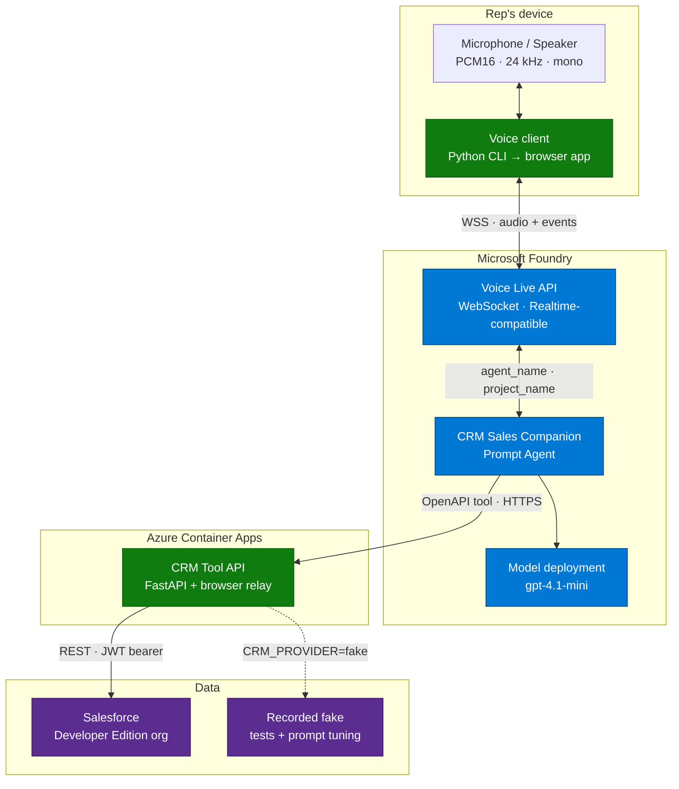
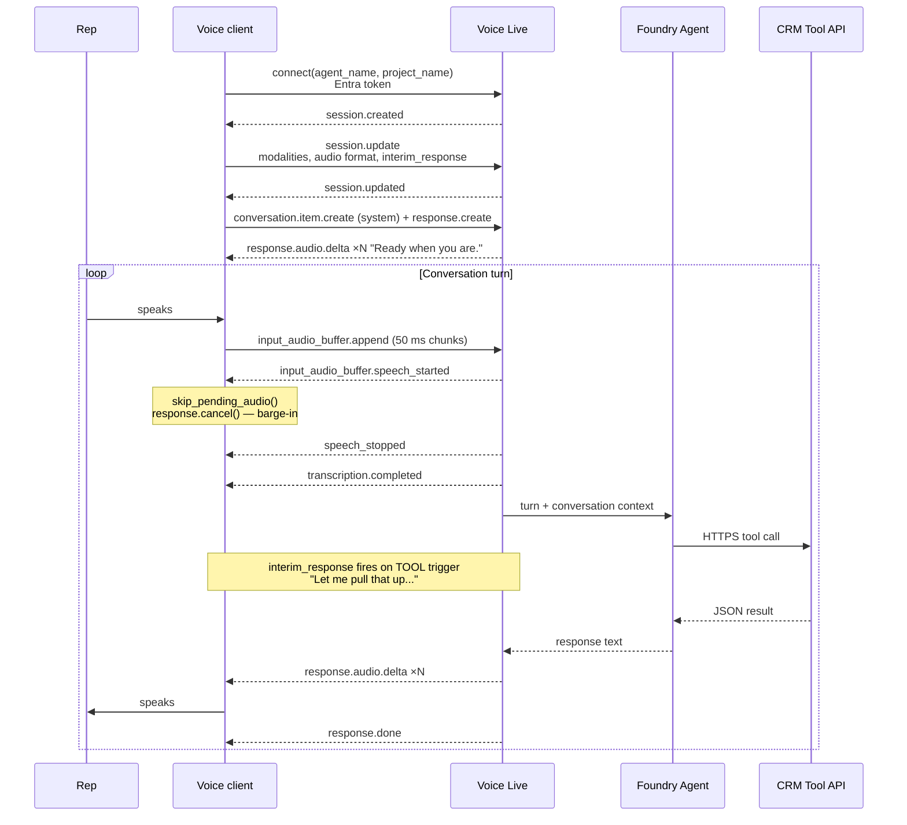
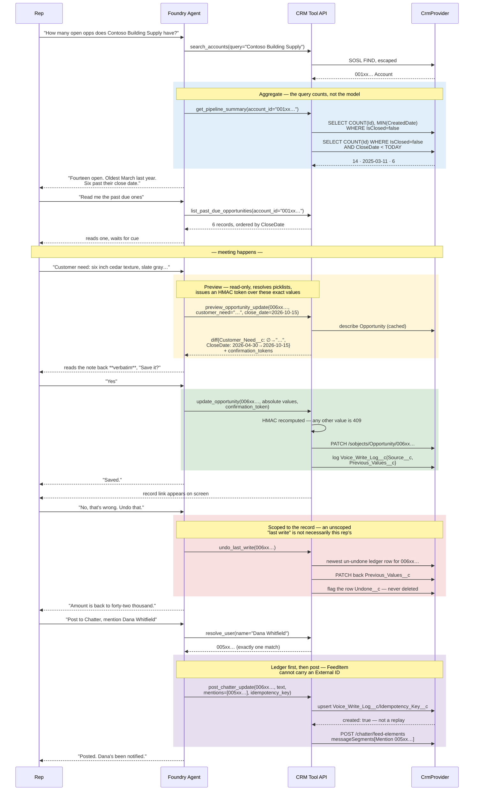
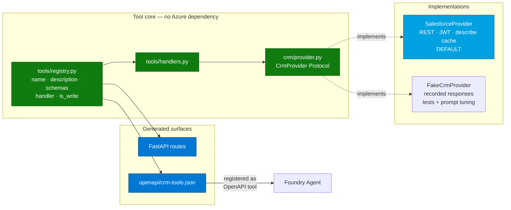
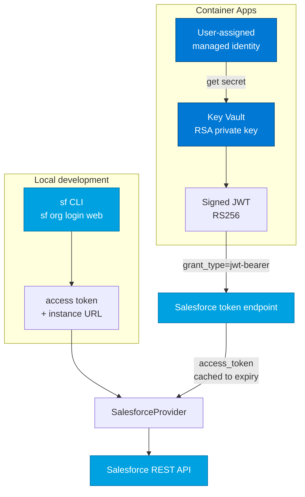
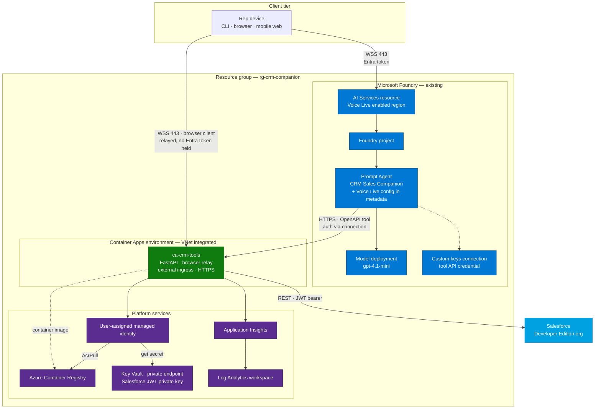
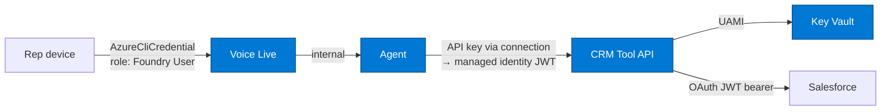

# CRM Sales Companion

A hands-free voice sales assistant for field sales representatives, built on **Microsoft Foundry Agent Service** and the **Voice Live API**.

A rep driving between customer sites talks to the assistant like a sales-ops colleague — pulling up accounts, reviewing opportunities, updating amounts and stages, and creating follow-up tasks — without touching a keyboard.

> **Status:** Running end to end against a live Salesforce Developer Edition org and deployed to Azure Container Apps. Voice CLI and browser client both work; reads, previewed writes, Chatter mentions, record links and undo are verified against real records.
>
> Wired to a live org from the start — no mock CRM dataset. A `CrmProvider` seam keeps tools decoupled from the data source, with a recorded in-memory fake used only for tests and offline prompt iteration so `pytest` needs no network and voice tuning doesn't burn API quota or litter the org.
>
> | | |
> |---|---|
> | Tools | 17, generated from one registry |
> | Tests | 290 offline · 20 live-org (`-m liveorg`) |
> | Verified scenes | Triage · capture · ambiguity · undo |
> | Known gaps | Telemetry not collected · writes attributed to the integration user · VAD untuned against road noise |
>
> Build progress, and the org-specific findings that shaped the design, are recorded in the
> [development log](docs/development-log.md).

---

## Table of contents

- [Target experience](#target-experience)
- [Architecture](#architecture)
  - [System context](#system-context)
  - [Voice flow](#voice-flow)
  - [Tool flow and the write-safety protocol](#tool-flow-and-the-write-safety-protocol)
  - [Provider layer](#provider-layer)
- [Salesforce integration](#salesforce-integration)
  - [Authentication](#authentication)
  - [Metadata bundle](#metadata-bundle)
  - [Object mapping](#object-mapping)
  - [Aggregate queries](#aggregate-queries)
  - [Chatter posts and @mentions](#chatter-posts-and-mentions)
  - [Durable idempotency](#durable-idempotency)
  - [Provenance and undo](#provenance-and-undo)
  - [Picklist resolution](#picklist-resolution)
  - [Query injection safety](#query-injection-safety)
  - [API limits](#api-limits)
- [Azure reference architecture](#azure-reference-architecture)
- [Key architectural decisions](#key-architectural-decisions)
- [Tool surface](#tool-surface)
- [Repository layout](#repository-layout)
- [Implementation plan](#implementation-plan)
- [Setup](#setup)
- [Local execution](#local-execution)
- [Deployment](#deployment)
- [Verification](#verification)
- [Future enhancements](#future-enhancements)
- [Development log](docs/development-log.md)

---

## Target experience

The scenario comes from field feedback: a rep parked outside a customer, needing to triage that account's pipeline before walking in, then capture the outcome from the car afterwards. Today that means writing a list down on paper on the way in, and typing notes later — if at all.

**Scene 1 — parked outside the customer, before the meeting**

```
Rep:    How many open opportunities does Contoso Building Supply have?
Agent:  Fourteen open. Oldest entered March last year. Six are past their
        close date.

Rep:    Read me the past due ones.
Agent:  Northgate Commons Phase 2, forty-two thousand, Bidding, closed date
        was April 30th.
        ...

Rep:    Next.
Agent:  Ashwood Commons, eighteen thousand, Negotiation, was June 15th.
```

**Scene 2 — back in the car, after the meeting**

```
Rep:    Update Northgate Commons Phase 2.
Agent:  Got it. Forty-two thousand, Bidding.

Rep:    Customer need: they want the wide plank finish in slate gray, about
        twelve hundred square feet.
Agent:  Customer Need will read: "They want the wide plank finish in slate
        gray, about twelve hundred square feet." Save it?

Rep:    Yes.
Agent:  Saved.

Rep:    Push the close date to October 15th.
Agent:  Close date April 30th to October 15th. Save it?

Rep:    Yes. And post to Chatter that pricing is sent, mention Dana
        Whitfield to confirm product availability.
Agent:  Posting to Northgate Commons Phase 2, mentioning Dana Whitfield.
        Post it?

Rep:    Yes.
Agent:  Posted. Dana's been notified.
```

Two things in Scene 1 are load-bearing. *"How many"* and *"how many past due"* are answered by a **SOQL aggregate**, not by the model counting records aloud — see [Aggregate queries](#aggregate-queries). And the past-due list is read one at a time on the rep's cue, because a fourteen-item list read continuously to someone in a car is useless.

In Scene 2, `Customer Need` is consumed downstream by supply chain for manufacturing, so it is read back verbatim before writing rather than summarised. The Chatter mention is a real notification to a named user, not text that merely looks like one — see [Chatter posts and @mentions](#chatter-posts-and-mentions).

Design rules baked into the agent instructions:

| Rule | Why |
|---|---|
| Responses under ~15 words unless reading back a change | The rep is driving; long responses are unsafe and unusable |
| Lists are read one item at a time, on cue | Fourteen opportunities read continuously is noise, not information |
| Counts and dates come from the query, never from the model | Aggregates are exact; LLM arithmetic over 40 records is slow and wrong |
| Free-text notes read back **verbatim** before writing | Supply chain manufactures from `Customer Need`; a paraphrase is a defect |
| Read back every field change before writing | Guards against misrecognition of amounts and dates |
| Never invent a record ID | Writes only accept IDs returned by a read in the same conversation |
| **Absolute values only, never deltas** | "Set it to 750k" survives a replay; "raise it by 250k" compounds |
| Every create carries an idempotency key | Road noise and repeated phrases must not create duplicate records |
| Stage names resolved against the live picklist | Spoken shorthand rarely matches the org's actual values |
| @mentions resolved to a User ID, ambiguity asked aloud | A mention that doesn't resolve fails **silently** — nobody is notified |
| Deep noise suppression + semantic VAD | Car cabin audio, engine noise, passengers, radio |

---

## Architecture

### System context



The critical property: **the client never executes tools**. It streams audio and renders audio. All reasoning and all CRM access happen server-side — which is why the browser client, added after the CLI, inherited the full capability set without reimplementing a single tool.

### Voice flow



Two details that make or break the in-car feel:

- **Barge-in.** On `speech_started` the client drops queued playback and cancels the in-flight response. Playback packets carry sequence numbers so late-arriving audio from the cancelled response is discarded rather than played over the rep.
- **Interim responses.** `LlmInterimResponseConfig(triggers=[TOOL, LATENCY], latency_threshold_ms=100)` makes the agent say something natural while a CRM round-trip is in flight. Without it, tool calls produce multi-second silences that sound like a dropped call.

### Tool flow and the write-safety protocol

Writes are gated. The agent cannot mutate a record it has not read, cannot mutate without an explicit spoken confirmation of a concrete diff, and cannot skip the read-back — the preview issues an HMAC token the write refuses to proceed without.



| Threat | Mitigation |
|---|---|
| Hallucinated record | Writes reject any ID not returned by a read in this conversation |
| Miscounted pipeline | Counts and dates come from SOQL aggregates, never model arithmetic |
| Paraphrased manufacturing note | `Customer Need` read back verbatim; the diff carries the exact string |
| Misheard amount or date | `preview_opportunity_update` returns a diff the agent reads back |
| **Agent skipping the read-back** | The write refuses without an HMAC token the preview issued over those exact values |
| **A "yes" the rep never meant** | The token proves a preview happened, not that consent was given — `undo_last_write` is what closes this |
| **"Undo" heard twice unwinding the day** | An undone row is flagged, and undo refuses it rather than reaching for the one before |
| **Undo reversing another rep's change** | Scoped to a named record, which the agent has because it just wrote to it |
| Replayed command compounding a value | Write tools accept absolute values only — never deltas |
| Duplicate task from repeated speech | Upsert on a **Unique External ID** field — enforced by Salesforce |
| Duplicate Chatter post | Write ledger upsert gates the post — `FeedItem` can't hold a custom field |
| **@mention that notifies nobody** | Name resolved to a User ID; ambiguous or unresolved is asked aloud, never guessed |
| **Wrong customer with a similar name** | `search_accounts` returns a resolution, so several matches cannot be read as a pick |
| Invalid stage name rejected by the API | Spoken stage resolved against cached `describe` picklist values |
| Spoken input reaching the query engine | SOSL with escaped reserved characters; IDs regex-validated |
| Background speech triggering a write | Confirmation phrase required; VAD tuned with deep noise suppression |
| Record ID read aloud as digits | The agent never speaks IDs or URLs; a link appears on the rep's screen instead |
| Accidental destructive edit | No delete tools exist in the surface at all |
| Change of unknown origin in the CRM | Every write leaves a `Source__c`-stamped ledger row |

### Provider layer

One registry is the single source of truth. REST routes and the OpenAPI document are both generated from it, so they cannot drift — and any future surface, MCP included, generates from the same declaration.



`CRM_PROVIDER` selects the implementation. `salesforce` is the default and what every demo and integration test runs against. `fake` exists so `pytest` needs no network or credentials, and so the dozens of iterations needed to tune prompts and barge-in don't consume API quota or leave junk records behind.

The fake is seeded from **recorded** Salesforce responses, not hand-written JSON — if the org's schema shifts, re-record rather than re-imagine.

---

## Salesforce integration

### Authentication

Two credential paths, each suited to its environment. The provider abstracts which one is in play.



The JWT bearer flow, used by the deployed API:

```http
POST https://login.salesforce.com/services/oauth2/token
grant_type=urn:ietf:params:oauth:grant-type:jwt-bearer
assertion=<RS256-signed JWT>
```

| JWT claim | Value |
|---|---|
| `iss` | Connected App consumer key |
| `sub` | Integration user's username |
| `aud` | `https://login.salesforce.com` (`test.salesforce.com` for sandboxes) |
| `exp` | now + 3 minutes |

The Connected App needs **Use digital signatures** with the public cert uploaded, OAuth scopes `api` and `refresh_token offline_access`, and the integration user's profile pre-authorized.

Salesforce credentials never leave the tool API. The agent holds no Salesforce identity — it authenticates to *our* API, and our API brokers onward. There is no password anywhere in the flow.

> **Reading the local session token.** Recent `sf` CLI versions redact secrets in `--json` output:
> `org display` returns the literal string `[REDACTED] Use 'sf org auth show-access-token' to view`
> for both `accessToken` and `sfdxAuthUrl`. Treating that as a token produces
> `INVALID_AUTH_HEADER`, which reads like a malformed request rather than a masked value.
> `SfCliTokenProvider` therefore reads the instance URL from `org display` and the token from
> `org auth show-access-token`, and rejects anything still starting with `[REDACTED`.

### Metadata bundle

`sf project deploy start --source-dir sfdx/force-app` creates **one custom object, ten custom
fields, and one permission set**. Nothing else — no data, no users, no layout changes, no profile
edits.

| Component | Object | Type | Why it exists |
|---|---|---|---|
| `Idempotency_Key__c` | `Activity` | Text(64) · External ID · Unique | Lets task creation be an upsert, so a repeated voice command can't create a second record. Defined once on `Activity`; surfaces on both `Task` and `Event` |
| `Customer_Need__c` | `Opportunity` | LongTextArea(32768) | The manufacturing note, written verbatim |
| `Comments__c` | `Opportunity` | LongTextArea(32768) | Dictated meeting notes |
| `Voice_Write_Log__c` | — | Custom object | The write ledger: idempotency, provenance and undo in one row |
| `Idempotency_Key__c` | `Voice_Write_Log__c` | Text(64) · External ID · Unique · required | The ledger key itself |
| `Operation__c` | `Voice_Write_Log__c` | Text(64) | Which tool issued the write |
| `Target_Record_Id__c` | `Voice_Write_Log__c` | Text(18) | Record the write targeted |
| `Result_Record_Id__c` | `Voice_Write_Log__c` | Text(18) | Record the write produced, so a replay can report it |
| `Source__c` | `Voice_Write_Log__c` | Text(80) | Which system produced the write — `CRM Sales Companion` |
| `Previous_Values__c` | `Voice_Write_Log__c` | LongTextArea(32768) | The fields this write changed, pre-write, as JSON. What undo restores |
| `Undone__c` | `Voice_Write_Log__c` | Checkbox | Set when reversed. Undo refuses an already-undone row rather than reaching further back |
| `CRM_Companion_Integration` | — | Permission set | Grants FLS on the above, object access on the ledger, and `Delete` on `Task` so a task created by mistake can be undone |

> **`Task` and `Event` do not take custom fields directly.** They share the `Activity` object,
> which is where the field is defined. Targeting `Task` or `Event` fails the deploy with
> `bad value for restricted picklist field`. Field-level *security*, however, is still granted
> per-object on `Task` and `Event` — the field is defined once but permissioned twice.

#### Three concepts the bundle depends on

**External ID + Unique.** Marking a field as an External ID makes it usable as an alternate key,
so `PATCH /sobjects/Task/Idempotency_Key__c/{value}` lets Salesforce decide whether that is a
create or an update. `Unique` is what makes the guarantee real — the database rejects a second
row with the same key. Without both flags, deduplication degrades to application memory, which
does not survive a restart or a second replica.

**Field-Level Security.** FLS is per-profile read/edit permission on each individual field,
layered on top of object permissions. Fields created by a metadata deploy get no FLS by default,
and `Modify All Data` does not bypass it. An unreadable field is not an error — it is silently
omitted from query results and dropped on write, so a missing permission looks exactly like a
field-mapping bug. The permission set removes that ambiguity.

This is observable: immediately after deploying, `sf sobject describe --sobject Opportunity`
lists none of the new fields. Assign the permission set, re-run the same command unchanged, and
they all appear. Nothing about the fields changed — only who was allowed to see them.

**Permission set.** A grantable bundle of object and field permissions that can be assigned to a
user without editing their profile. Assign it to whichever user the integration authenticates as:

```bash
sf org assign permset --name CRM_Companion_Integration --target-org devorg
```

The `description` element is capped at **255 characters**; exceeding it fails the deploy with
`data value too large`.

#### Deliberately not in the bundle

| Omitted | Why |
|---|---|
| `Bidding` stage value | `StageName` is a `StandardValueSet`; deploying one **replaces every value in it**. Too much blast radius for one entry — add it in Setup. |
| Page layout changes | Layout metadata is bulky and overwrites whatever is already there. The fields will not appear in the UI until added manually. |
| Chatter enablement | Org-level setting, not deployable source. |
| Users | Created in Setup; the demo needs a second one as an @mention target. |
| Stretch product fields | Product finish, colour, area, trim length and prices are designed but not yet authored — they are not needed for the core scenario. |

That second row matters during verification: the acceptance script asks you to confirm
`Customer_Need__c` in the Salesforce UI, and you will not see the field on the Opportunity page
until you add it to the layout. Until then, read it back with a query instead:

```bash
sf data query --query "SELECT Id, Name, Customer_Need__c FROM Opportunity LIMIT 5" --target-org devorg
```

### Object mapping

| Domain model | Salesforce object | Notable fields |
|---|---|---|
| Account | `Account` | `Id`, `Name`, `Industry`, `Phone`, `BillingCity`, `BillingState` |
| Contact | `Contact` | `Id`, `AccountId`, `Name`, `Title`, `Email`, `Phone` |
| Opportunity | `Opportunity` | `Id`, `AccountId`, `Name`, `Amount`, `StageName`, `CloseDate`, `CreatedDate`, `IsClosed` |
| Task | `Task` | `Subject`, `ActivityDate`, `WhatId`, `WhoId`, `OwnerId`, `Status`, `Priority`, `Description` |
| Logged call | `Task` with `Type='Call'`, `Status='Completed'` | Salesforce models a completed call as a Task, not a distinct object |
| Meeting | `Event` | `Subject`, `StartDateTime`, `WhatId` |
| Chatter post | `FeedItem` via `/chatter/feed-elements` | Structured `messageSegments`, not a plain string |
| User (mention target) | `User` | `Id`, `Name`, `IsActive` |

The mapping is explicit in `crm/salesforce_mapping.py` rather than inferred. Field names like `WhatId` and `ActivityDate` carry no meaning to the model, so the domain layer speaks `account_id` and `due_date` and the mapping translates.

#### Approximated custom fields

The fields the field team actually works in don't exist in a stock Developer Edition org, so the POC creates stand-ins with the same shape and purpose. **These are approximations — real API names must be confirmed against the production org before any of this leaves POC status.**

| Purpose | POC field | Type | Notes |
|---|---|---|---|
| Meeting notes / comments | `Comments__c` | Long Text Area (32k) | Production may use standard `Description` |
| Manufacturing requirement | `Customer_Need__c` | Long Text Area (32k) | **Consumed downstream by supply chain** — written verbatim |
| Product finish | `Product_Texture__c` | Picklist | Stretch scope |
| Product colour | `Product_Color__c` | Picklist | Stretch scope |
| Primary area | `Area_Sqft__c` | Number | Stretch scope |
| Trim length | `Trim_Linear_Ft__c` | Number | Stretch scope |
| Area / trim price | `Area_Price__c`, `Trim_Price__c` | Currency | Stretch scope |
| Write ledger | `Voice_Write_Log__c` | Custom object | Idempotency for objects that can't carry an External ID |

A `Bidding` value is also added to the `StageName` picklist — field feedback suggests that is the stage which triggers product detail capture, but **that is unconfirmed** and needs verification against the real sales process.

Because the mapping is config-driven, pointing at the production org later is a configuration change plus a `describe` dump, not a rewrite.

### Aggregate queries

*"How many open opportunities, what's the oldest, how many are past due"* is the question that opens the workflow — and it is the wrong job for a language model. Fetching forty records so the model can count them and compare dates is slow, expensive, and unreliable, and the failure is invisible: a confidently wrong number read aloud in a car.

Salesforce answers it directly:

```sql
-- summary
SELECT COUNT(Id) total, MIN(CreatedDate) oldest
FROM Opportunity
WHERE AccountId = '001xx...' AND IsClosed = false

-- past due
SELECT Id, Name, Amount, StageName, CloseDate, CreatedDate
FROM Opportunity
WHERE AccountId = '001xx...' AND IsClosed = false AND CloseDate < TODAY
ORDER BY CloseDate ASC
```

`TODAY` is a SOQL date literal evaluated server-side in the user's locale, so "past due" needs no client clock and no timezone reasoning. `IsClosed` is a formula field maintained by Salesforce from the stage, so it stays correct when stages are customised.

`get_pipeline_summary` returns counts and dates as **structured values**; the agent's only job is to speak them. `list_past_due_opportunities` returns records ordered by `CloseDate` so the agent can read them one at a time on the rep's cue rather than emptying the list into the cabin.

### Chatter posts and @mentions

The requirement is *"put an @Person Name to send an alert to the person we need to update."* The word "alert" is the requirement — a post that merely contains the characters `@Dana Whitfield` notifies nobody. It looks right in the UI and silently does nothing, which is the worst possible failure mode for a hands-free tool.

A real mention is a structured segment referencing a **User ID**:

```json
POST /services/data/vXX.X/chatter/feed-elements
{
  "feedElementType": "FeedItem",
  "subjectId": "006xx...",
  "body": {
    "messageSegments": [
      { "type": "Text",    "text": "Pricing sent. " },
      { "type": "Mention", "id": "005xx..." },
      { "type": "Text",    "text": " please confirm product availability." }
    ]
  }
}
```

So `resolve_user` sits in front of every mention:

| Resolution outcome | Behaviour |
|---|---|
| Exactly one active user matches | Proceed, name read back in the confirmation |
| Several match | Agent asks aloud which one — never picks |
| None match | Agent says so and offers to post without the mention |
| User inactive | Treated as no match |

The same pattern as picklist resolution: resolve against the org, surface ambiguity as a spoken question, never guess.

### Durable idempotency

Deduping an `idempotency_key` in a process-local dictionary works right up until the Container App restarts or scales to a second replica — then a replayed voice command creates a **second real record in the customer's CRM**. In-process state is the wrong place for this guarantee.

For objects that accept custom fields, Salesforce enforces it directly. A custom field on `Task`:

```xml
<CustomField xmlns="http://soap.sforce.com/2006/04/metadata">
    <fullName>Idempotency_Key__c</fullName>
    <label>Idempotency Key</label>
    <type>Text</type>
    <length>64</length>
    <externalId>true</externalId>
    <unique>true</unique>
</CustomField>
```

Creates become upserts keyed on that field:

```http
PATCH /services/data/vXX.X/sobjects/Task/Idempotency_Key__c/{key}
```

| Response body | Meaning | What the agent says |
|---|---|---|
| `{"id": "00T…", "created": true}` | First time this key was seen | "Task created." |
| `{"id": "00T…", "created": false}` | Replay — same record, updated in place | "Already got that one." |

The response body reports which happened, so no HTTP status inspection is needed. Verified against the org: issuing the identical PATCH twice returns the same record id with `created` flipping from `true` to `false`, and `SELECT COUNT(Id) ... WHERE Idempotency_Key__c = ?` returns exactly 1. That flag is what lets the assistant respond honestly to a repeated command instead of silently reporting success twice.

**`FeedItem` can't carry a custom field**, so Chatter posts can't use that mechanism. They go through a write ledger instead — a `Voice_Write_Log__c` custom object with its own Unique External ID. The tool upserts the ledger row first; `201` means proceed with the post, `204` means this is a replay and the post is skipped. Same guarantee, one extra call, and it generalises to any future object that can't be extended.

**Updates need none of this.** Setting `CloseDate = 2026-10-15` twice leaves the same state, so `Opportunity` needs no External ID field. That property only holds because write tools accept **absolute values and never deltas** — the reason that rule is enforced in the tool contract rather than left to the prompt.

### Provenance and undo

The ledger started as a dedupe gate for Chatter. Every write now leaves a row there, because provenance and undo want the same record: one says the change came from the companion, the other needs the values it replaced. Two stores would have had to be kept in step for no gain.

```
Operation__c            Source__c              Undone__c  Previous_Values__c
undo                    CRM Sales Companion    false
update_opportunity      CRM Sales Companion    true       {"amount":"42000.0"}
post_chatter_update                            false
```

That blank `Source__c` is a real row from an earlier deployment — provenance visibly separating tagged writes from untagged ones.

**Record-level attribution cannot carry this on its own.** `LastModifiedById` names the integration user today, and will name the rep once writes are attributed per person. Neither says the change arrived by voice, which is what you want to know when a value looks wrong.

**A lost audit row must not fail a write that already landed.** Ledger failures are logged, not raised. Raising would give the worst outcome available: the change is in the CRM, the rep is told it failed, and they say it again.

**Undo is scoped to a record.** It first shipped taking no arguments, on the reasoning that a driving rep should not have to name one. In live testing it reversed a change to a different opportunity, from a different session, made minutes earlier by the test suite. The mechanism was right and the scope was wrong — `undo_last_write` now takes the record ID the agent just wrote to, and refuses to guess when it does not have one.

**Reversals are flagged, not deleted.** An undone row keeps its history and is excluded from being undone again; reversals are logged as `undo` and are never candidates themselves. So "undo, undo, undo" over road noise reverses exactly one change. A create is reversed by deleting the record and clearing the replay key, so saying the same command again creates a real record rather than reporting a replay of something that no longer exists.

### Picklist resolution

`Opportunity.StageName` is a picklist whose values are org-specific. A stock org ships:

```
Prospecting · Qualification · Needs Analysis · Value Proposition
Id. Decision Makers · Perception Analysis · Proposal/Price Quote
Negotiation/Review · Closed Won · Closed Lost
```

A rep says *"move it to Proposal."* Writing the literal string `Proposal` fails — the value is `Proposal/Price Quote`. So the provider calls `describe` on `Opportunity`, caches the picklist, and resolves spoken shorthand against it. An unresolvable or ambiguous stage is an error the agent surfaces as a spoken question, never a guess.

This generalises: any picklist the tools write to gets resolved the same way, which is what keeps the assistant portable to a production org with customised stages.

### Query injection safety

`search_accounts` builds a query from **spoken user input**, and the Salesforce REST API has **no bind parameters** for SOQL — the query is a string you assemble. That is a live injection surface.

Two distinct input classes, handled differently:

**Record IDs** — always sourced from a prior read, never from speech. Validated against `^[a-zA-Z0-9]{15}([a-zA-Z0-9]{3})?$` before interpolation. A value failing that regex is rejected outright, which makes ID interpolation safe by construction.

**Free text** — account names, note bodies, user names. Never interpolated into SOQL. Handled by:

1. **SOSL for name search** — `FIND {term} IN NAME FIELDS RETURNING Account(Id, Name, Industry)`, with SOSL reserved characters escaped: `? & | ! { } [ ] ( ) ^ ~ * : \ " ' + -`
2. **Escaped SOQL literals** where SOSL doesn't fit — backslash and single-quote escaped, length-capped, character-class validated
3. **Request bodies, not queries**, for note text — `Customer_Need__c` travels as JSON in a `PATCH` body, so it never touches the query parser at all

Escaping lives in one place, `crm/soql.py`, with tests covering the reserved-character set. It is not open-coded per call site.

### API limits

Developer Edition allows **15,000 API calls per rolling 24 hours**. A single voice turn can spend several — search, describe, read, preview, write.

That budget is fine for demos and integration runs, and completely inadequate for the iteration loop of tuning agent instructions. Hence `CRM_PROVIDER=fake` for prompt work and the full test suite, `salesforce` for anything that needs to be real.

---

## Azure reference architecture



### Resource inventory

| Resource | Purpose | Provisioned by |
|---|---|---|
| Microsoft Foundry AI Services + project | Hosts Voice Live and the agent | **Existing** — referenced as a parameter |
| Model deployment (`gpt-4.1-mini`) | Agent reasoning. **Not a realtime model** — agent mode runs the agent through the Responses API, which rejects them | Existing |
| Model deployment (`gpt-realtime`) | Speech, supplied by Voice Live itself | Existing |
| Prompt Agent | Instructions, Voice Live session config, OpenAPI tool binding | `agent/provision.py` |
| Salesforce Developer Edition org | System of record | **Existing** — Connected App added during setup |
| Virtual network | Private path from the container app to Key Vault | Bicep |
| Container Apps environment | VNet-integrated runtime for the tool API | Bicep |
| Container App — CRM Tool API | Executes CRM tools, relays browser audio to Voice Live | Bicep + `az acr build` |
| Azure Container Registry | Container images | Bicep |
| User-assigned managed identity | ACR pull, Key Vault access, Voice Live token | Bicep |
| Key Vault (private endpoint only) | Salesforce JWT signing key | Bicep |
| Log Analytics + Application Insights | Provisioned; **nothing sends to it yet** | Bicep |

### Identity and authentication



Non-negotiables:

- **Voice Live agent mode is Entra-only.** API keys are rejected outright for agent invocation. Local dev uses `AzureCliCredential`; deployed clients use managed identity.
- **The tool API is never anonymous.** It exposes write endpoints on a public ingress that mutate a real CRM. It authenticates via an API key stored in a Foundry custom-keys connection, moving to managed identity with Entra JWT validation.
- **No secrets in source, in agent metadata, or in the container image.** The Salesforce private key lives in Key Vault and is fetched at runtime via managed identity. Agent metadata holds Voice Live session config only.
- **The `.key` and `.pem` files generated during setup are gitignored.** They are the credential.

---

## Key architectural decisions

### Agent mode over model mode

Voice Live supports two topologies. We use **agent mode**.

| | Model mode | **Agent mode (chosen)** |
|---|---|---|
| Tool execution | Client-side, in-process | **Server-side, by Foundry** |
| Instructions live in | Session config, per connection | **Agent definition, versioned** |
| Auth | API key or Entra | **Entra only** |
| Tool API reachability | Not required | **Must be publicly reachable** |
| New client cost | Reimplement tools per client | **Zero — clients only stream audio** |

The tradeoff we accepted: Foundry has to reach the tool API, so even local development needs a dev tunnel. We took it because it means the browser client, and any future mobile or telephony client, inherits every capability without reimplementing a single tool.

### OpenAPI tools for the voice path, MCP as a parallel surface

The MCP tool's `require_approval` defaults to `always`, and that approval handshake is submitted through the runs API — which a Voice Live session does not surface. An MCP write tool would therefore hang forever in a voice conversation.

So: **the voice path uses OpenAPI tools.** An MCP server over the same registry stays designed but unbuilt — it would expose the identical tools to clients where the approval loop is both available and desirable (IDE agents, chat surfaces), which is worth doing once such a client exists.

### Salesforce REST directly, not the Salesforce DX MCP Server

Worth stating plainly because the question comes up: this project talks to Salesforce's REST API through its own provider rather than consuming [`@salesforce/mcp`](https://github.com/salesforcecli/mcp). Assessed August 2026, three properties rule it out for this runtime — any one of them alone would.

| | Salesforce DX MCP Server | What this runtime needs |
|---|---|---|
| Data surface | `run_soql_query` — one tool, read-only | Update opportunity, create task, post Chatter |
| Auth | Locally authorized orgs via the `sf` CLI | Server-side JWT bearer, no human at a keyboard |
| Transport | `npx` stdio, local process | HTTPS endpoint Foundry can reach |

It has no record write tools at all, so the entire Scene 2 half of the demo has nothing to call.

The deeper mismatch survives even if those three are fixed. `run_soql_query` hands the model **raw query power**, which is the exact opposite of what a rep doing 70mph needs. This tool surface is deliberately narrow and opinionated — `preview_opportunity_update` returns a diff to read back, `resolve_stage` refuses to guess between two picklist values, creates carry idempotency keys, and no tool accepts a relative adjustment. Those properties are the product. A general-purpose query tool cannot express them, and a voice agent holding one can invent record IDs, do its own arithmetic, and duplicate records on a repeated phrase.

**Where it genuinely fits: the developer inner loop.** Deploying metadata, running Apex tests, Code Analyzer, LWC scaffolding, querying an org while writing code — that is what its 60+ tools are built for, and it is good at it. It is developer tooling, not a runtime CRM data plane. Salesforce's own docs warn that enabling every toolset "can overwhelm the LLM context."

This is not a bet against MCP. The convergence point is the other direction: an MCP server over *this* registry would give an MCP-standardised organisation the same seventeen voice-safe tools on the protocol it already uses. And because `CrmProvider` is a seam, a future Salesforce MCP server with transactional write tools and a service-principal auth model could be added as another implementation without touching the tool layer.

### Preview-then-commit instead of client-side confirmation

Confirmation logic lives in the tool contract, not just the prompt. `preview_opportunity_update` is a real read-only endpoint returning a structured diff with the picklist already resolved, and it issues an HMAC token over exactly those values. The write refuses anything else.

The instruction to preview came first and was not enough. In a live run the agent skipped it on `Customer_Need__c` — the rep's phrasing sounded like a statement of fact rather than a request, which is exactly when a free-text manufacturing note arrives. Anything the prompt alone enforces is a behaviour, not a guarantee.

### Undo instead of tighter confirmation

The token proves a preview happened. It cannot prove the rep meant to say yes — after a read-back, a "yeah" aimed at a passenger produces a valid token and a real write. Tightening the confirmation wording only narrows that window.

Undo closes it, and was nearly free: the preview already computes the before-state, so persisting it in the ledger turns "put that back" into a lookup and a reverse write. For a voice interface where mishearing is structural, recovery is worth more than any further amount of gating — which is also why undo itself takes no confirmation token. Gating the recovery path defeats it.

### Idempotency in the database, not the process

The obvious implementation — a dictionary of seen idempotency keys — silently fails on restart or a second replica, and the failure mode is duplicate records in a customer's CRM. Pushing the constraint into a **Unique External ID** field makes Salesforce itself the arbiter, and the `201` vs `204` response tells the agent which happened.

This only works because writes are restricted to absolute values. A delta-based API (`increase_amount_by`) cannot be made idempotent this way, which is why that shape was excluded from the tool surface.

### Live org from day one, recorded fake for iteration

Building against mock data first tends to produce tools shaped around imagined records — and every real-schema surprise arrives late. Going live-first surfaced picklist resolution, External ID upserts, and SOQL escaping as *design* concerns rather than integration bugs.

The fake still exists, but it is a recorded test double, not a parallel data model: `pytest` runs offline, prompt iteration doesn't consume the 15k/day API budget, and demos run against real records.

---

## Tool surface

Seventeen tools, all generated from `tools/registry.py`.

| Tool | Kind | Notes |
|---|---|---|
| `search_accounts` | read | SOSL name search, escaped. Returns an `AccountResolution`, so several hits cannot be read as a pick |
| `get_account` | read | Account detail by ID |
| `get_pipeline_summary` | read | **Aggregate** — open count, past-due count, oldest `CreatedDate`, total open amount |
| `list_open_opportunities` | read | Open opportunities for an account, soonest close date first |
| `list_past_due_opportunities` | read | `IsClosed = false AND CloseDate < TODAY`, ordered for one-at-a-time reading |
| `get_opportunity` | read | Opportunity detail by ID, including current notes |
| `list_contacts` | read | Contacts at an account |
| `get_contact` | read | Contact detail by ID |
| `list_tasks` | read | Open tasks for the running user, soonest due first |
| `resolve_user` | read | Name → User ID for Chatter mentions, filtered by licence; ambiguity returned, never guessed |
| `resolve_stage` | read | Spoken shorthand → the org's real picklist value; ambiguity returned, never guessed |
| `preview_opportunity_update` | **preview** | Read-only diff, picklists resolved, note text carried verbatim. Issues the confirmation token the writes require |
| `update_opportunity` | **write** | Stage, close date, amount. Absolute values only, token required |
| `update_opportunity_notes` | **write** | `Comments__c` and `Customer_Need__c`. Verbatim, no summarisation, token required |
| `create_task` | **write** | Upsert on `Idempotency_Key__c` |
| `post_chatter_update` | **write** | Structured `messageSegments` with real mentions; ledger-gated |
| `undo_last_write` | **write** | Reverses the last companion change to one named record, once |

No delete operations exist, and no tool accepts a relative adjustment. A voice interface in a moving car is the wrong place for destructive verbs or arithmetic that compounds on replay.

Designed but not built: `create_activity`, `create_call_report` and `set_opportunity_product_details` — the stretch capabilities in [Future enhancements](#future-enhancements).

---

## Repository layout

```
Dockerfile                          tool API + relay image
azure.yaml                          azd service definition
pyproject.toml                      dependencies, tooling, pytest config
infra/
  main.bicep                        subscription-scope entry point
  resources.bicep                   VNet, ACR, UAMI, Key Vault (private endpoint),
                                    VNet-integrated ACA env, container app, monitoring
  main.parameters.json
sfdx-project.json                   sf CLI project root, points at sfdx/force-app
sfdx/
  force-app/main/default/
    objects/
      Activity/fields/Idempotency_Key__c.field-meta.xml  shared by Task + Event
      Opportunity/fields/
        Comments__c.field-meta.xml                       approximated
        Customer_Need__c.field-meta.xml                  approximated
      Voice_Write_Log__c/                                write ledger
        Voice_Write_Log__c.object-meta.xml
        fields/Idempotency_Key__c.field-meta.xml         External ID + Unique
        fields/Operation__c.field-meta.xml
        fields/Target_Record_Id__c.field-meta.xml
        fields/Result_Record_Id__c.field-meta.xml
        fields/Source__c.field-meta.xml                  provenance stamp
        fields/Previous_Values__c.field-meta.xml         what undo restores
        fields/Undone__c.field-meta.xml                  reversed, not deleted
    permissionsets/
      CRM_Companion_Integration.permissionset-meta.xml   FLS for the above
src/crm_companion/
  config.py                         pydantic-settings; each subsystem fails fast via require_*
  crm/
    models.py                       pydantic domain models, resolutions, write log
    provider.py                     CrmProvider Protocol — the seam — + stage matching
    factory.py                      provider_scope(): selects fake vs Salesforce
    salesforce_provider.py          DEFAULT — reads, writes, ledger, undo
    salesforce_client.py            REST transport, upsert, feed items, error mapping
    salesforce_auth.py              sf CLI token (local) / JWT bearer (deployed)
    salesforce_mapping.py           domain ↔ SObject field translation, config-driven
    soql.py                         SOSL/SOQL escaping + ID regex validation
    fake_provider.py                recorded responses; tests + prompt tuning
    recording.py                    sanitises captured responses into the fixture
  data/crm_fixture.json             the recorded fixture, committed
  tools/
    registry.py                     single source of truth for all 17 tools
    schemas.py                      tool inputs; record IDs validated at the boundary
    handlers.py                     the handlers
    confirmation.py                 HMAC write tokens — preview as a precondition
  api/
    app.py                          FastAPI; routes generated from registry
    security.py                     API key guard
    openapi.py                      spec builder
    realtime.py                     browser ↔ Voice Live WebSocket relay
    links.py                        record links pushed to connected browsers
    static/                         browser client — chat + mic toggle
  agent/
    instructions.py                 driving-optimized prompt + write/undo policy
    voicelive_config.py             session config + 512-char metadata chunking
    provision.py                    create/update agent version
    smoketest.py                    text-mode agent test — no audio
  voice/
    audio.py                        PyAudio capture/playback, barge-in queue
    session.py                      shared Voice Live event loop
    cli.py                          agent-mode CLI entry point (crm-voice)
openapi/crm-tools.json              generated artifact, committed
scripts/
  seed_org.py                       creates the demo Account + Opportunities
  record_fixtures.py                captures live responses for the fake
  export_openapi.py                 writes openapi/crm-tools.json
  create_tool_connection.py         Foundry connection holding the tool API key
  deploy_connected_app.sh           Connected App via metadata deploy
  new_jwt_cert.sh                   self-signed cert for the Connected App
tests/                              tools, API, agent, provision, voice, provider,
                                    fixtures, and the opt-in live-org suite
docs/development-log.md             build log and findings
```

Four modules named in earlier drafts were never created: `aggregates.py`, `chatter.py`, `users.py` and `ledger.py` each came to 15–20 lines, and splitting them would have added indirection without separation — they stayed in `salesforce_provider.py`. `mcp/server.py` is [parked](#openapi-tools-for-the-voice-path-mcp-as-a-parallel-surface).

---

## Implementation plan

Phases 1–7 are complete and verified against the live org and the deployed environment. Phase 8 is deliberately parked — see [below](#phase-8--mcp-and-docs).

### Phase 1 — Org access and preparation ✅
*Nothing else can be verified until the API answers.*

1. Install the Salesforce CLI, `sf org login web`, confirm API access with a raw REST call
2. Create the Connected App: digital signatures, self-signed cert, scopes `api` + `refresh_token offline_access`, pre-authorized profile
3. Deploy the metadata bundle — `Idempotency_Key__c` on `Task`/`Event`, the approximated Opportunity fields, the `Bidding` stage value, and `Voice_Write_Log__c`
4. Confirm Chatter is enabled and a second test user exists to be @mentioned
5. Run `scripts/seed_org.py` — a demo account with ~14 open opportunities, 6 deliberately past due, spread across stages and entry dates
6. Verify the JWT bearer flow independently of the app

### Phase 2 — Domain and provider ✅

7. pydantic domain models and the `CrmProvider` Protocol
8. `salesforce_auth.py` — sf CLI token locally, JWT bearer deployed, with token caching
9. `soql.py` — escaping and ID regex validation with tests over the full reserved-character set, **before** any query is built
10. `salesforce_provider.py` — reads, describe cache, stage resolution, upsert-by-External-ID, aggregates, mentions, ledger
11. `record_fixtures.py` → `fake_provider.py` seeded from real captured responses, sanitised

### Phase 3 — Tool core ✅

12. `tools/registry.py` — the keystone every other surface generates from
13. The handlers, including `get_pipeline_summary`, `preview_opportunity_update`, `post_chatter_update`, `undo_last_write`
14. `confirmation.py` — HMAC tokens making preview a precondition rather than an instruction
15. pytest against the fake: aggregates, idempotency replay, ledger gating, mention resolution, stage resolution, escaping, token forgery, undo scope

### Phase 4 — Tool API and OpenAPI spec ✅

16. FastAPI routes generated from the registry, explicit `operationId` per tool
17. API-key validation as a security scheme, not a header parameter — a credential the model can supply is one it can invent
18. OpenAPI 3.1 export with populated `servers[]`, validated in the test suite

### Phase 5 — Foundry agent ✅

19. Instructions: driving-optimized, preview-before-write, absolute values, ambiguity, undo
20. Voice Live session config plus 512-char metadata chunk/reassemble helpers
21. `provision.py` — create/update the agent version with the OpenAPI tool attached
22. `smoketest.py` — **text-mode** test proving tool calling before audio enters the picture

### Phase 6 — Voice clients ✅

23. 24 kHz PCM16 mono audio, 50 ms chunks, generation-numbered playback for barge-in
24. Agent-mode connect, proactive greeting, barge-in, dual logging
25. Browser client — Web Audio capture, WebSocket relay through the tool API, chat transcript with a mic toggle, record links pushed to screen

### Phase 7 — Deploy ✅

26. Bicep: VNet, ACR, Container Apps, managed identity, **private-endpoint Key Vault for the Salesforce key**, monitoring
27. Deploy, repoint `servers[0].url`, re-provision the agent

### Phase 8 — MCP and docs

28. MCP server over the same registry — **parked**. The voice path uses OpenAPI tools because MCP's approval handshake never surfaces in a Voice Live session, so this buys nothing until there is a second, non-voice client to serve.

---

## Setup

### Prerequisites

| Requirement | Notes |
|---|---|
| Python 3.11+ | |
| Salesforce CLI | See below — `npm i -g @salesforce/cli` may be blocked by a corporate registry proxy |
| Salesforce Developer Edition org | With **admin/Setup access** — required for the Connected App and custom field |
| Azure CLI | `az login` — agent mode requires Entra auth |
| Azure Developer CLI (`azd`) | Deployment |
| `devtunnel` CLI | Local dev — Foundry must reach your tool API |
| PortAudio | macOS: `brew install portaudio` (PyAudio dependency) |
| Microsoft Foundry project | In a Voice Live–supported region, with a model deployment |
| Role: **Foundry User** | On the Foundry resource, for your account |

### Installing the Salesforce CLI

The npm package bundles a pinned `npm` release of its own, which some corporate registry
proxies do not mirror. The Homebrew cask is deprecated for failing the macOS Gatekeeper check.
The standalone tarball avoids both — it ships its own Node runtime and touches no registry:

```bash
curl -fsSL -o /tmp/sf.tar.xz \
  https://developer.salesforce.com/media/salesforce-cli/sf/channels/stable/sf-darwin-arm64.tar.xz
tar -xJf /tmp/sf.tar.xz -C ~/.local/
ln -sf ~/.local/sf/bin/sf ~/.local/bin/sf
sf --version
```

Swap `darwin-arm64` for `darwin-x64` or `linux-x64` as needed. Uninstall is
`rm -rf ~/.local/sf ~/.local/bin/sf`.

### Salesforce org preparation

```bash
# 1. Generate the keypair the Connected App will trust
./scripts/new_jwt_cert.sh                   # writes .secrets/server.key + server.crt

# 2. Create the Connected App in Setup > App Manager > New Connected App
#      - Enable OAuth Settings
#      - Callback URL: http://localhost:1717/OauthRedirect  (required field,
#        unused by JWT)
#      - Use digital signatures -> upload .secrets/server.crt
#      - Scopes: "Manage user data via APIs (api)" and
#                "Perform requests at any time (refresh_token, offline_access)"
#      - Save, then Manage > Edit Policies:
#          Permitted Users = "Admin approved users are pre-authorized"
#        then Manage > Profiles > add your profile
#      Copy the Consumer Key into SF_CLIENT_ID
#
#      Connected App changes take 2-10 minutes to propagate. The first JWT
#      attempt failing with invalid_grant usually just means you were early.

# 3. Authenticate the CLI with JWT - no browser, no localhost callback
sf org login jwt \
  --username "<your-org-username>" \
  --jwt-key-file .secrets/server.key \
  --client-id "<consumer key>" \
  --alias devorg --set-default

sf org display --target-org devorg           # confirm connection

# 4. Deploy the metadata bundle
#    sfdx-project.json is at the repo root, so this runs from there
sf project deploy start --source-dir sfdx/force-app --target-org devorg

# 5. Grant the integration user access to the new fields
#    Metadata-deployed fields carry no field-level security; without this they
#    are silently absent from API responses and dropped on write.
sf org assign permset --name CRM_Companion_Integration --target-org devorg

# 6. Add the "Bidding" stage value by hand
#    Setup > Object Manager > Opportunity > Fields > Stage > New
#    Deliberately NOT in the metadata bundle: StageName is a StandardValueSet,
#    and deploying one replaces every value in it. Not worth the blast radius
#    to add a single entry.

# 7. Confirm Chatter is on and create a second user to @mention
#    Setup > Chatter Settings > Enable
#    Setup > Users > New User  (the @mention target used by the demo)

# 8. Seed the demo records
python -m scripts.seed_org

# 9. Capture fixtures for the offline fake
python -m scripts.record_fixtures
```

> **On `sf org login web`.** The web flow starts a listener on `localhost:1717` and waits for
> the browser to redirect back to it. Browsers configured with a corporate proxy that does not
> exempt loopback will fail to reach it, and the CLI reports `AuthTimeoutError` even though the
> login itself succeeded. Chrome and Safari bypass proxies for localhost by default; Firefox
> often does not. JWT avoids the callback leg entirely, which is why it is the documented path
> here as well as the deployed one.

> `.secrets/` is gitignored. `server.key` is the credential that grants API access to the org — it belongs in Key Vault, never in the repo or the container image.

### Configuration

Copy `.env.example` to `.env` and fill in:

```bash
# Provider selection
CRM_PROVIDER=salesforce          # or 'fake' for offline prompt iteration

# Salesforce
SF_LOGIN_URL=https://login.salesforce.com   # test.salesforce.com for sandboxes
SF_CLIENT_ID=<Connected App consumer key>
SF_USERNAME=<integration user>
SF_PRIVATE_KEY_PATH=.secrets/server.key     # local only; Key Vault when deployed
SF_API_VERSION=<pin after checking /services/data>
SF_ORG_ALIAS=devorg                         # used by the sf CLI auth path

# Foundry project
PROJECT_ENDPOINT=https://<resource>.services.ai.azure.com/api/projects/<project>
PROJECT_NAME=<project>
MODEL_DEPLOYMENT_NAME=gpt-4.1-mini           # not a realtime model — see below

# Voice Live
VOICELIVE_ENDPOINT=https://<resource>.services.ai.azure.com/
VOICELIVE_API_VERSION=<pin to installed SDK — see note below>
VOICE_NAME=en-US-Ava:DragonHDLatestNeural

# Agent
AGENT_NAME=crm-sales-companion
AGENT_VERSION=            # optional — pin for controlled rollout
CONVERSATION_ID=          # optional — resume a prior conversation

# Tool API
TOOL_API_BASE_URL=https://<devtunnel-or-aca-fqdn>
TOOL_API_KEY=<generated>
```

> **Version pinning.** Current docs show `2026-01-01-preview` for agent-mode connect and `2026-04-10` for model mode. Pin both against the installed `azure-ai-voicelive` and `azure-ai-projects` versions before writing session code rather than trusting the doc snippets. Same for the Salesforce REST version — read `/services/data` and pin it.

> **The agent's model is not a realtime model.** In agent mode, Voice Live supplies speech itself and runs the agent through the Responses API, which rejects realtime deployments. Point `MODEL_DEPLOYMENT_NAME` at a text deployment. The failure mode is silent: the session returns `response.done` with zero tokens and the reason only in `status_details`.

---

## Local execution

```bash
# 1. Install
python -m venv .venv && source .venv/bin/activate
pip install -e ".[dev,api,azure,voice]"

# 2. Tests — offline, no Azure or Salesforce needed
pytest

# 3. Confirm live Salesforce access (writes to the org; opt-in)
pytest -m liveorg

# 4. Generate the OpenAPI spec
python -m scripts.export_openapi

# 5. Run the tool API against the dev org
uvicorn crm_companion.api.app:app --reload --port 8000

# 6. Expose it to Foundry (separate terminal)
devtunnel host -p 8000 --allow-anonymous
# Copy the tunnel URL into TOOL_API_BASE_URL

# 7. Register the key as a Foundry connection, then provision the agent
az login
python -m scripts.create_tool_connection
python -m crm_companion.agent.provision

# 8. Text-mode smoke test — verify tool calling before touching audio
python -m crm_companion.agent.smoketest
python -m crm_companion.agent.smoketest --prompt "How many open opportunities does <account> have?"

# 9. Full voice conversation — terminal, or the browser client at http://localhost:8000
crm-voice
```

Step 8 exists deliberately. Debugging tool invocation and audio plumbing simultaneously is miserable; proving the agent calls tools correctly over text first removes an entire class of confusion from step 9.

While iterating on agent instructions, set `CRM_PROVIDER=fake`. Prompt tuning takes dozens of runs, and each live turn spends several of Developer Edition's 15,000 daily API calls while leaving real Tasks behind in the org. Switch back to `salesforce` to validate.

---

## Deployment

```bash
azd auth login
azd env new crm-tools

# Point at the existing Foundry project
azd env set PROJECT_ENDPOINT "<project endpoint>"
azd env set AZURE_LOCATION "<voice-live-supported region>"

# Build the image, then provision (see note below on why not `azd deploy`)
TAG="v$(date +%Y%m%d%H%M%S)"
az acr build --registry <acr> --image "crm-tools:$TAG" --file Dockerfile .
azd env set CONTAINER_IMAGE "<acr>.azurecr.io/crm-tools:$TAG"
azd provision --no-prompt

# Repoint the tool spec at the deployed API and re-register the agent
azd env get-value TOOL_API_BASE_URL
python -m scripts.export_openapi
python -m crm_companion.agent.provision
```

`azd provision` creates the VNet, Container Apps environment, registry, managed identity, private-endpoint Key Vault, and monitoring. The Foundry project is referenced, never created — the plan assumes you already own it.

> **Two deployment traps, both found the hard way.** `azd deploy`'s remote build fails here with `InvalidCorrelationRequestId`, so images are built with `az acr build` and passed in as a parameter. And never tag an image `:latest` — `az containerapp update` reports success and rolls nothing, because the image reference is unchanged. Always use a unique tag and confirm the new revision is `Running` with `trafficWeight: 100` before testing.

---

## Verification

| # | Check | Command |
|---|---|---|
| 1 | Handlers, tokens, undo scope, idempotency, escaping, spec validity | `pytest` — 290 tests, ~4s, no credentials |
| 2 | Assumptions only a real org can confirm | `pytest -m liveorg` — 20 tests, ~90s |
| 3 | OpenAPI spec regenerates and matches the registry | `python -m scripts.export_openapi` |
| 4 | Agent invokes tools correctly, no audio | `python -m crm_companion.agent.smoketest` |
| 5 | Full spoken loop | `crm-voice`, or the browser client |
| 6 | Deployed path | `azd provision` → re-provision the agent → repeat 5 |

The offline suite needs no credentials and runs in about four seconds. `pytest -m liveorg` is
opt-in because it spends API quota and writes to the org; it covers the things mocks
cannot — that fields are actually readable, that `Bidding` really is an Open stage, that
Salesforce genuinely dedupes an upsert, that a Chatter mention survives as a
structured segment rather than becoming plain text, that one spoken account name can mean
three different customers, and that a misheard note can be put back.

**Acceptance script for check 5** — speak all three scenes end to end:

*Scene 1 — triage*
1. "How many open opportunities does &lt;demo account&gt; have?" → counts match a manual SOQL run **exactly**
2. "Read me the past due ones" → reads one, stops, waits
3. "Next" → reads the second. Confirm it never dumps the whole list
4. Ask about an account whose name several customers share → it reads the names back and asks which, rather than answering about one of them

*Scene 2 — capture*
5. "Update &lt;demo opportunity&gt;" → correct opportunity identified
6. Dictate a Customer Need → agent reads it back **word for word**, not summarised
7. "Yes" → verify in the Salesforce UI that `Customer_Need__c` matches the spoken text exactly
8. "Push the close date to October 15th" → diff read back, confirmed, written
9. Interrupt mid-sentence → playback stops immediately, agent yields
10. "Post to Chatter, mention &lt;demo user&gt;" → confirm, post
11. **Log in as that user and confirm the notification arrived** — a post containing the literal text `@Name` is a failure, not a pass
12. Repeat step 10 verbatim → agent says it already posted, and the feed shows **exactly one** post

*Scene 3 — recovery*
13. Set an amount to an obviously wrong value and confirm it → a record link appears on screen and the agent never speaks the ID
14. "No, that's wrong. Undo that." → the agent states the restored value from the tool, and the org shows the original
15. Say "undo" again → it reports there is nothing to undo, and the change before it is **still intact**
16. Query `Voice_Write_Log__c` → every change above appears, stamped `Source__c = CRM Sales Companion`

Steps 7, 11, 12 and 15 are the ones that get skipped, and each covers a failure that is invisible from the driver's seat: a paraphrased manufacturing note, a mention that notifies nobody, a duplicate post, and an undo that quietly unwinds more than the rep asked for. All four are verifiable in the org rather than by trusting the agent's own account of itself.

---

## Future enhancements

### Known gaps

Things that are wrong or missing today, in the order they would matter in a pilot.

- **Telemetry is provisioned but collects nothing.** `APPLICATIONINSIGHTS_CONNECTION_STRING` is injected into the container and nothing calls `configure_azure_monitor`. That matters more here than in a normal service: when the agent does something strange in a car, the rep can't screenshot it and won't remember the wording. Without tool-call spans and token issue/verify pairs there is nothing to reconstruct from.
- **Every write is attributed to the integration user.** Salesforce's audit trail says the integration user changed that opportunity, not the rep. The `Source__c` stamp says it came from the companion, but not from whom. The JWT bearer flow already names a subject, so per-rep attribution is a session-scoped username rather than a redesign.
- **Turn latency is unmeasured end to end.** The tool API is 145 ms warm for a pipeline summary and ~550 ms for `search_accounts` — but `silence_duration_ms = 700` is a guess, and it is additive on every single turn. Past about two seconds of silence a voice agent feels broken, and we do not currently know which side of that line we are on. Measure before tuning.
- **VAD is untuned against real road noise.** Deep noise suppression and semantic VAD are configured, never validated in a moving vehicle.
- **Record links broadcast to every session.** Correct for one rep with one tab, wrong for concurrent users — correlating a tool call back to a session needs an identifier Foundry does not pass through. Documented in `api/links.py`.
- **The browser holds the master API key.** In memory only, never persisted, but it is the same full-write key the Foundry connection uses. It should be a short-lived scoped session token minted after a real sign-in.
- **`/docs` and `/openapi.json` are publicly reachable** on the deployed app.

### Near term

- **Managed identity for the tool API.** Replace the API-key connection with Foundry managed identity plus Entra JWT validation at the Container App.
- **Conversation resume.** Thread `conversation_id` through reconnects so a dropped cellular connection resumes mid-thought instead of starting over.
- **Undo beyond the last change.** Today one change per record, once. A short spoken history — "what did I change on this one?" — falls out of the ledger almost for free.

### Stretch capabilities

| Capability | Utterance | Composition |
|---|---|---|
| Pre-meeting briefing | "Brief me on my next customer" | `list_tasks` + `get_account` + `get_opportunity`, summarized for audio |
| Post-meeting capture | "Record today's notes" | Extended dictation → `create_call_report` + `create_activity` |
| Forecast coaching | "What should I focus on this week?" | Pipeline query ranked by stage, amount, and staleness |
| Generated follow-ups | Automatic after a call report | Draft task, activity, and follow-up email for review |
| Product detail capture | "Cedar texture, slate gray, 1200 square feet" | `set_opportunity_product_details` — fields designed, not yet authored |

### Platform

- **Multi-rep identity.** Per-rep Entra identity federated to Salesforce, so the assistant acts *as* the rep rather than as a shared integration user.
- **Evaluation suite.** Batch evals over recorded conversations for tool-selection accuracy and confirmation compliance — the two behaviors that must not regress.
- **MCP surface.** The registry is ready; it needs a non-voice client to justify it.
- **Custom voice.** A brand-aligned voice via Azure custom neural voice (requires eligibility approval).
- **Telephony.** The same agent behind a phone number for reps without the app.
- **Production org hardening.** Field-level security review, a dedicated integration profile with least-privilege object permissions, and API call budgeting against the production org's limits.
